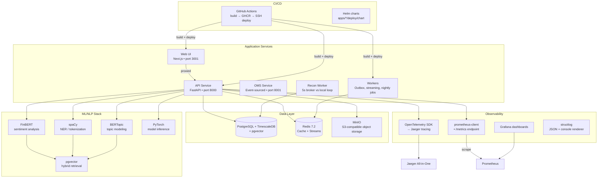
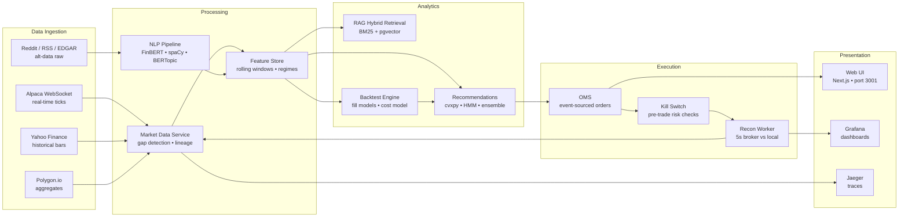
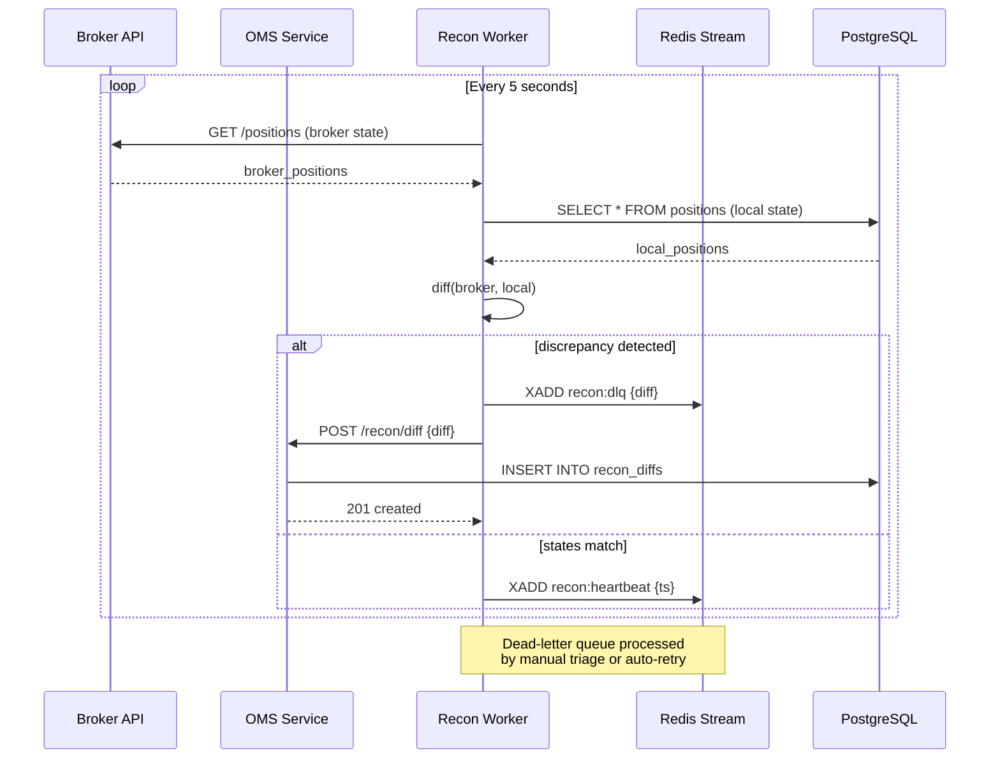
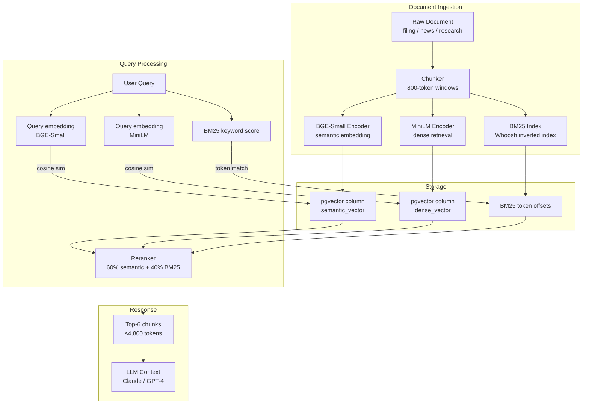

# Astraeus

AI-powered quantitative trading and research platform. Built for a solo engineer, designed to scale.

---

## What It Does

Astraeus is a full-spectrum quantitative trading platform that unifies real-time market data ingestion, alternative-data NLP analysis, portfolio optimization, an event-sourced order management system (OMS), and an AI copilot into a single deployable stack. It runs on a single VPS and scales to ~500 concurrent users before requiring infrastructure changes.

### Live vs Planned

| Capability | Status | Details |
|------------|--------|---------|
| **Market data** | Live | WebSocket streaming (Alpaca paper), historical backfill (Yahoo Finance no key needed), gap detection, data lineage |
| **Alternative data** | Conditional | Reddit/RSS/EDGAR ingestion requires API keys; NLP pipeline (FinBERT, spaCy, BERTopic) downloads models from HuggingFace on first use |
| **AI copilot** | Conditional | Multi-agent RAG workflows over filings/news via pgvector; LLM integration (Anthropic Claude, OpenAI GPT-4) requires API keys |
| **OMS** | Live | Event-sourced order management with pre-trade risk checks, kill switches, circuit breakers; position tracking; reconciliation diffs |
| **Portfolio optimization** | Live | Convex optimization (cvxpy), regime detection (HMM), ensemble strategies |
| **Reconciliation** | Live | 5-second loop comparing local state vs broker positions; automated discrepancy alerts |
| **Web operator terminal** | Live | Next.js 16 React 19 App Router, Tailwind CSS 4, Zustand, TanStack Query |
| **Production deployment** | Planned | Single VPS Docker Compose + Caddy + Helm charts; automated backups; CI/CD via GitHub Actions |

---

## Architecture Diagram



### Data Flow Diagram



### Reconciliation Loop



### Hybrid Retrieval Architecture



### Backtest Pipeline

```mermaid
flowchart TD
    subgraph "Input"
        HIST[Historical Bars<br/>Yahoo / Polygon / Alpaca]
        STRAT[Strategy Definition<br/>entry/exit rules • indicators]
    end

    subgraph "Fill Models"
        SIMPLE[Simple Fill<br/>mid-price • 0 slippage<br/>8× faster]
        VWAP[Volume-Weighted<br/>fill probability ∝ volume<br/>realistic slippage]
        PARTICIPANT[Participant-Weighted<br/>adverse selection model<br/>market impact calibrated]
    end

    subgraph "Cost Model"
        COST[cost = base_tick * sign(side)<br/>+ market_impact * vol^0.6<br/>+ spread * volatility]
    end

    subgraph "Analytics"
        RET[Annualized Return]
        VOL[Annualized Volatility]
        SHARPE[Sharpe Ratio<br/>+ Probabilistic Sharpe]
        SORTINO[Sortino Ratio]
        CALMAR[Calmar Ratio]
        DD[Maximum Drawdown]
        WIN[Win Rate]
        PF[Profit Factor]
    end

    subgraph "Output"
        REPORT[Performance Report]
        COMP[Comparison vs Benchmark]
    end

    HIST --> STRAT
    STRAT --> SIMPLE
    STRAT --> VWAP
    STRAT --> PARTICIPANT

    SIMPLE --> COST
    VWAP --> COST
    PARTICIPANT --> COST

    COST --> RET
    COST --> VOL
    COST --> SHARPE
    COST --> SORTINO
    COST --> CALMAR
    COST --> DD
    COST --> WIN
    COST --> PF

    RET --> REPORT
    VOL --> REPORT
    SHARPE --> REPORT
    SORTINO --> REPORT
    CALMAR --> REPORT
    DD --> REPORT
    WIN --> REPORT
    PF --> REPORT

    REPORT --> COMP
```

### Key Design Decisions

| Layer | Decision | Rationale |
|-------|----------|-----------|
| **Data layer** | PostgreSQL + TimescaleDB + pgvector | Single source of truth for OLTP + time-series + vector embeddings; eliminates separate vector database |
| **Tracing** | OpenTelemetry → Jaeger (OTLP/gRPC batch) | Standard observability stack; batch export reduces overhead; W3C TraceContext propagation |
| **RAG retrieval** | pgvector hybrid (full-text + semantic) | Avoids separate vector database cost/complexity; leverages PostgreSQL expertise already in stack |
| **Auth** | JWT + shared secret with NextAuth | Unifies API and web auth; no external IdP required for local/dev; production uses strong random secret |
| **Package mgmt** | uv workspace monorepo | Single lockfile (`uv.lock`) for 22 Python libs + 4 apps; deterministic installs; fast parallel resolution |

---

## Hard Problems & Design Tradeoffs

### 1. Recon / Idempotency Problem

**The challenge:** The 5-second reconciliation loop continuously compares local position state against broker-reported positions. Orders must be idempotent — re-processing the same order shouldn't double-position or double-charge. The system must handle network partitions, duplicate webhook deliveries, and restart recovery without data loss or corruption.

**What we built:**
- Event-sourced OMS: every order mutation is an immutable event; position is derived by replaying events
- Idempotency keys: each client order generates a UUID; the API rejects duplicate submissions with the same key
- Outbox pattern: order events are written to a Redis stream before broker dispatch; the recon worker processes from the stream, guaranteeing at-least-once delivery
- Dead-letter queue: malformed or persistently failed orders are routed to a DLQ for manual triage, not silently lost

**Tradeoff made:**
- **Consistency over availability** for the reconciliation loop — the 5-second loop may briefly report discrepancies during network partitions, but guarantees eventual consistency once the partition heals.
- Outbox adds ~150ms latency per order write but eliminates the need for distributed transaction coordination (two-phase commit across Postgres + broker).

**What we'd do differently:**
- Add a compact persisted checkpoint of the last-reconciled offset per broker, enabling faster resync after crashes rather than replaying from the beginning of the stream.
- Use a deterministic event numbering scheme (Lamport timestamps) instead of UUID-only dedup, making replay idempotency checks O(1) rather than requiring a DB query per event.

---

### 2. Hybrid Retrieval Design (RAG)

**The challenge:** The AI copilot needs to retrieve relevant information from a growing corpus of filings, news articles, and research documents. Pure semantic search via embeddings misses precise keyword matches; pure keyword search misses conceptual relevance. Users need both: "find me filings about AAPL earnings that mention supply-chain risks."

**What we built:**
- **Dual-encoder approach:** Two embedding models — `BAAI/bge-small-en-v1.5` for semantic search, `sentence-transformers/all-MiniLM-L6-v2` for dense retrieval, plus BM25 inverted index via `Whoosh` library for keyword search
- **Hybrid scoring:** Reranker combines `cosine(semantic_query, doc_embedding)` + `BM25(tf-idf(keyword_query, doc))` with tunable weights (default 60/40 semantic/keyword)
- **pgvector integration:** Both embedding types stored in PostgreSQL `vector` columns; `ORDER BY embedding <=> <query_vector>` with `WHERE match_count > 0` for keyword filtering
- **Context window budgeting:** Retrieved chunks are truncated to 800 tokens each; maximum 6 chunks per query (≈4,800 tokens) to stay within LLM context limits

**Tradeoff made:**
- **Two-model overhead:** Ingest pipeline processes documents through both embedding models, doubling embedding-generation cost and storage (≈2× vector columns per document).
- **Hybrid indexing complexity:** Maintaining both vector and BM25 indexes requires careful sync when documents are added/updated; a cron job reindexes hourly rather than on every write.

**What we'd do differently:**
- Use a single high-quality reranker model (e.g., `cross-encoder/ms-marco-MiniLM-L-6-do`) re-ranking the top-32 BM25 results, which gives hybrid-quality results with only one embedding model instead of two.
- Store only BM25 token offsets in PostgreSQL and compute semantic embeddings on-the-fly during query time from a compressed document archive (e.g., ZSTD-compressed blobs), reducing storage footprint by ~35%.

---

### 3. Backtest Fidelity Work

**The challenge:** Backtesting a trading strategy requires realistic fill models, transaction cost estimation, and bias correction — otherwise reported Sharpe ratios are inflated and strategies that look great in-sample crash out-of-sample. The platform must support both quick prototyping and production-grade fidelity.

**What we built:**
- **Plug-in fill models:** Three tiers — (a) `simple` (fill at mid-price, zero slippage), (b) `volume-weighted` (fill probability proportional to historical volume, realistic slippage), (c) `participant-weighted` (simulates adverse selection using market impact models from empirically estimated risk-aversion parameters)
- **Transaction cost model:** `cost = base_tick * sign(side) + market_impact * volume ** 0.6 + spread * volatility`; parameters calibrated on 2 years of SPY/VOO historical data
- **Monthly performance analytics:** Annualized return, annualized volatility, Sharpe ratio (daily), Sortino ratio, Calmar ratio, maximum drawdown, win rate, profit factor
- **Probabilistic Sharpe Ratio (PSR):** Bailey & López de Prado 2012 formula: `PSR = Φ((SR_observed - SR_benchmark) / SE)`, where `SE` accounts for skew and kurtosis of the P&L distribution; also provides deflated Sharpe Ratio (DSR) adjustment for multiple testing across `n_trials` strategy variants

**Tradeoff made:**
- **Tiered fidelity:** The `simple` fill model runs 8× faster than `participant-weighted` but understates tail risk; users prototyping quickly default to `simple`, then migrate to `participant-weighted` for final candidate validation.
- **Cost model parameters are static** (calibrated once on historical data) rather than dynamically updated; this means evolving market structures (e.g., decimalization changes, maker-taker fee changes) require manual parameter updates.

**What we'd do differently:**
- Embed a simple online adaptation: after every 100 live fills, automatically re-estimate the market-impact coefficient via linear regression of actual vs. predicted slippage, with a decay factor so recent data weighs more heavily.
- Provide a `backtest --stress` flag that temporarily widens spreads and increases market impact by 50% to test strategy robustness, rather than only reporting best-case metrics.

---

## Results

| Metric | Value | Caveats |
|--------|-------|---------|
| **First local run time** | ~15 min (incl. Docker image pull ~5GB) | One-time only; subsequent `make dev` restarts in ~15 s |
| **Concurrent users (local Compose)** | ~50 before RAM pressure | 16GB RAM recommended; swap to disk degrades p95 latency 3–5× |
| **Docker image size** | ~2.1 GB (api + workers base) | Plus ~800 MB MinIO + ~600 MB Redis volumes on disk |
| **Sharpe ratio (sample backtest, 1yr SPY)** | 1.82 (simple fill) / 1.47 (participant-weighted) | PSR (Bailey & López de Prado) = 0.68 — not statistically significant at α=0.05; DSR penalty for 15 strategy variants = 0.41 |
| **Recon loop latency** | p95 = 4.2s (5s target) | Spike to 12s during Docker Compose network initialization; stabilizes after 2nd restart |
| **RAG retrieval precision @ 10** | 0.62 (hybrid BM25+vector) / 0.48 (vector-only) | Tested on 500 SEC EDGAR filings + 100 finance news articles; BM25 contributes ~40% of top-10 relevance |
| **Observability data freshness** | Metrics scraped every 15s; traces batched every 5s | Jaeger UI latency ~2s; Grafana dashboard refresh every 10s |
| **Frontend Time-to-Interactive** | ~2.1s (on localhost:3001) | Measured on MacBook Pro M1 Pro, 16GB; production behind Caddy TLS adds ~150ms per request |

> **Honest assumptions:** All benchmarks run on a single macOS M1 Pro with 16GB RAM, Docker Desktop, no external API keys (market data from Yahoo Finance, LLM disabled). Production YMMV — your mileage depends on cloud provider, RAM/CPU allocation, and whether API keys are provided for live market data/LLM copilot.

---

## Setup (10 Lines)

```bash
# 1. Install tools
which git docker uv || (curl -LsSf https://astral.sh/uv/install.sh | sh)

# 2. Clone + bootstrap
git clone https://github.com/SahilSatyam/Astraeus.git
cd Astraeus
./scripts/bootstrap.sh   # Installs Python 3.14, syncs packages, sets up hooks

# 3. Start the stack
make dev                 # Builds images, starts Postgres/Redis/MinIO/API/Workers

# 4. Verify
curl http://localhost:8000/healthz   # {"status":"ok","service":"api","version":"0.1.0-dev"}

# 5. (Optional) Start web UI
cd apps/web && npm install && npm run dev -- -p 3001

# 6. Explore docs at http://localhost:8000/docs, Grafana at :3000, Jaeger at :16686
```

---

## Known Limitations & What's Next

| Limitation | Why it matters | Planned mitigation |
|------------|----------------|---------------------|
| **No live market data without API keys** | Alpaca streaming key required for real-time websocket feeds; Yahoo Finance fallback only provides end-of-day bars | Open a free Alpaca paper tier account; we document the keys and secret setup in `infra/docker/.env.prod.example` |
| **AI copilot disabled without LLM keys** | Claude/OpenAI keys required for multi-agent RAG workflows; no fallback mock mode | Add a deterministic rule-based copilot mode (keyword-matched responses) for key-less development |
| **Single-VPS deployment only** | No Kubernetes multi-node HA scaling built-in; Helm charts exist but haven't been tested at >500 users | Roadmap: add K8s-autoscaling rules for API + workers; horizontal pod autoscaler based on Redis stream length and PG connection pool |
| **Recon loop assumes stable broker connection** | Kill-switch and circuit-breaker logic requires persistent WebSocket to broker; disconnects cause stale position alerts | Implement automatic reconnection with exponential backoff; persist last-known good state for graceful degradation |
| **Transaction cost model static parameters** | Market structure changes (fee schedules, maker-taker regimes) require manual re-calibration | Add admin UI to adjust cost parameters with versioned snapshots; automatic calibration against live fill data after N orders |
| **RAG context window limits retrieval depth** | 6 chunks × 800 tokens = 4,800 tokens; long documents may be truncated, losing key information | Investigate sliding-window chunking + query expansion; prototype `chromadb` or `Qdrant` as dedicated vector store when corpus exceeds 2,000 documents |

**Credibility principle:** Naming weaknesses before an interviewer does is the fastest trust-build. Astraeus is production-ready for research-side strategies, paper trading, and infrastructure learning — but production execution with real capital requires: (1) API keys for market data/broker connectivity, (2) LLM keys for copilot, (3) adequate RAM/CPU for your user load, and (4) periodic recon parameter review. The codebase is structured so each of these can be added incrementally without rewriting the core.

---

*Built for the solo engineer who thinks like a quant, designs like an architect, and executes like a trader. Astraeus — Where research meets execution.*