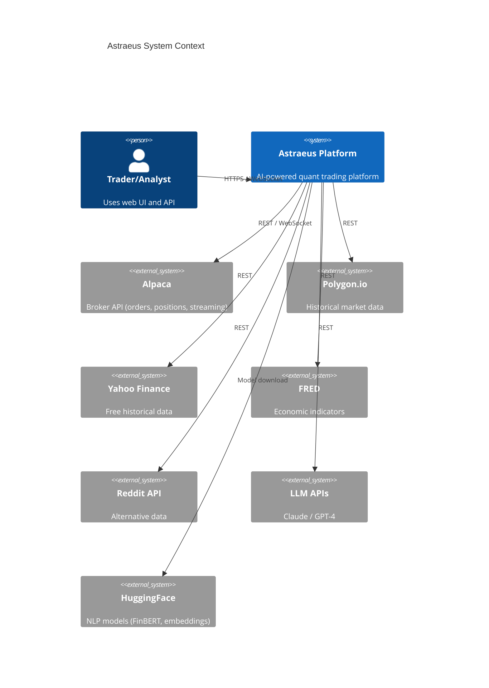
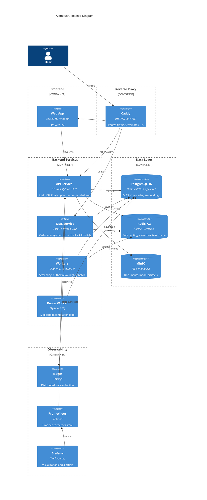
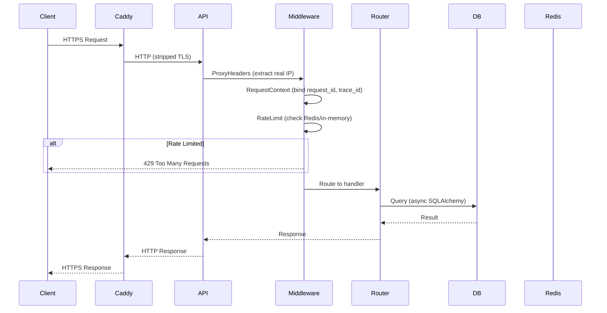
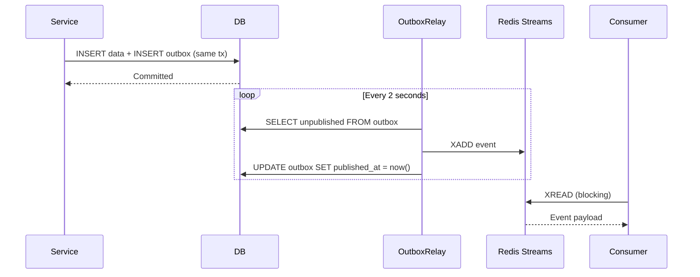
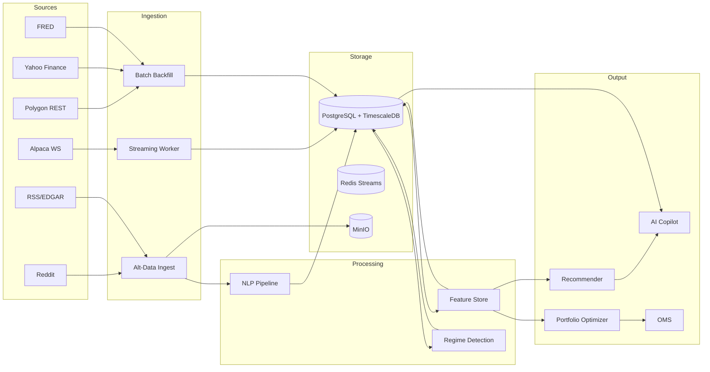
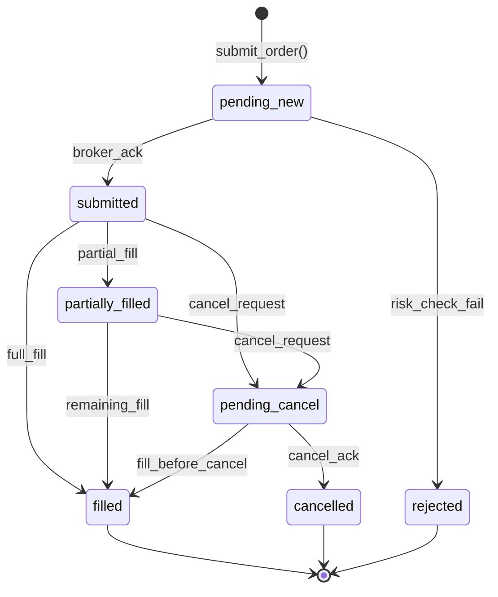
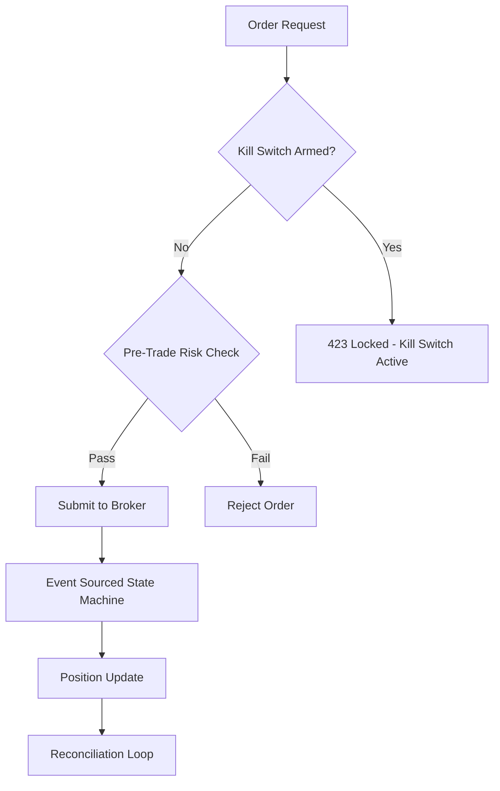

# Architecture Overview

## Executive Summary

Astraeus is an institutional-grade AI-powered quantitative trading and research platform. It combines real-time market data ingestion, NLP-driven alternative data analysis, portfolio optimization, order management, and an AI copilot into a single deployable stack.

**Business Problem:** Provide a solo engineer or small team with the same quantitative research and trading infrastructure that institutional hedge funds use — at a fraction of the cost (~$30/month on a single VPS).

**Key Goals:**
- Real-time market data ingestion and streaming
- AI-assisted trade research and recommendations
- Automated portfolio construction with risk management
- Event-sourced order management with pre-trade risk checks
- Full observability and auditability

## Non-Functional Requirements

| Requirement | Target |
|-------------|--------|
| Scalability | ~500 concurrent users on single VPS (16GB RAM) |
| Availability | 99.5% uptime (single-node, graceful degradation) |
| Latency (API) | p95 < 250ms for CRUD, p95 < 2s for AI workflows |
| Data Freshness | Real-time streaming (sub-second), batch nightly |
| Security | JWT auth, RBAC, secrets validation, rate limiting |
| Observability | Structured logging, distributed tracing, metrics |
| Cost | < $30/month infrastructure |

## Architectural Principles

1. **Monorepo with workspace isolation** — All 22 Python libraries and 5 apps share a single lockfile but maintain strict import boundaries.
2. **Event-driven where it matters** — Outbox pattern for reliable event publishing; Redis Streams for inter-service communication.
3. **Fail-fast on misconfiguration** — Services refuse to boot in staging/prod with default development secrets.
4. **Point-in-time correctness** — All financial data uses bitemporal modeling (event_ts + knowledge_ts) to prevent lookahead bias.
5. **Defense in depth** — Rate limiting, pre-trade risk checks, circuit breakers, kill switches, and reconciliation loops.
6. **Observability by default** — Every request gets a trace_id, request_id, and structured log context.

## Design Decisions and Trade-offs

| Decision | Rationale | Trade-off |
|----------|-----------|-----------|
| Single VPS deployment | Cost efficiency, operational simplicity | No HA, single point of failure |
| PostgreSQL + TimescaleDB | One database for OLTP + time-series + vectors | Higher memory usage vs. specialized stores |
| Redis for everything (cache, streams, rate limiting) | Operational simplicity | Not as durable as Kafka for event streaming |
| Monorepo (uv workspace) | Single lockfile, atomic refactors, shared CI | Larger clone, longer initial sync |
| FastAPI + async | High throughput on single process, native async DB | Python GIL limits CPU-bound work |
| Docker Compose (not K8s) for prod | Simplicity for single-node | Manual scaling, no auto-healing |

---

## High-Level Architecture Diagram

## Container Diagram

## Request Lifecycle

## Event Flow (Outbox Pattern)

## Data Flow Overview

## Order Lifecycle (Event Sourcing)

## Kill Switch Flow

