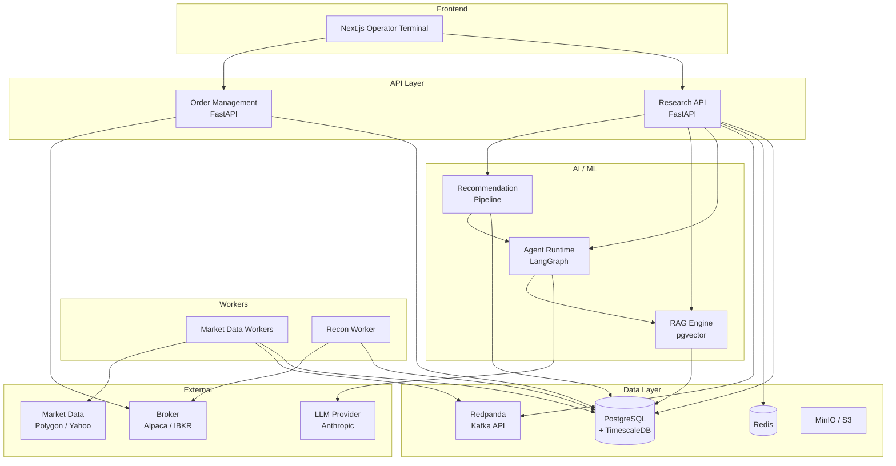
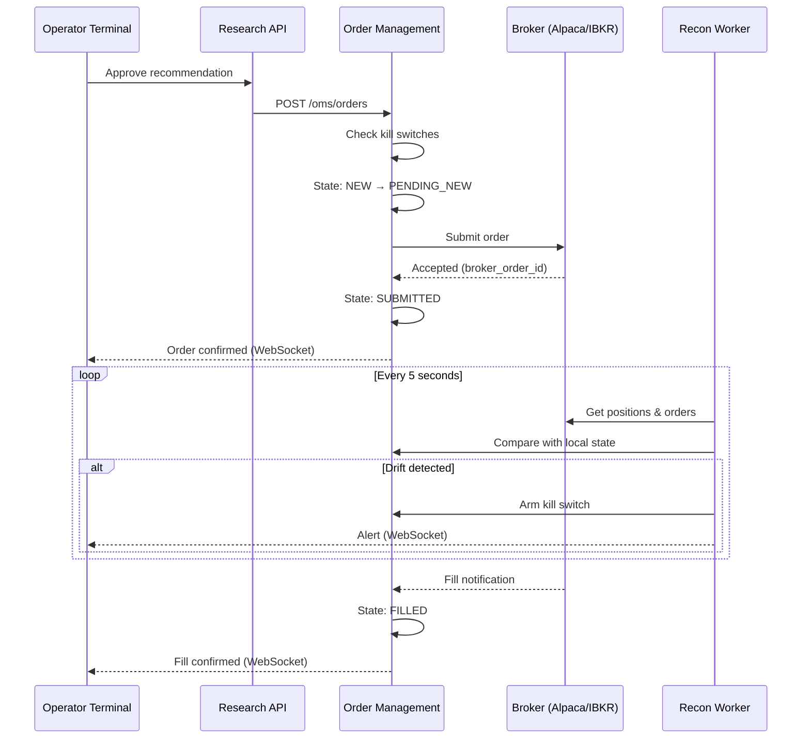
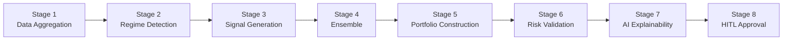
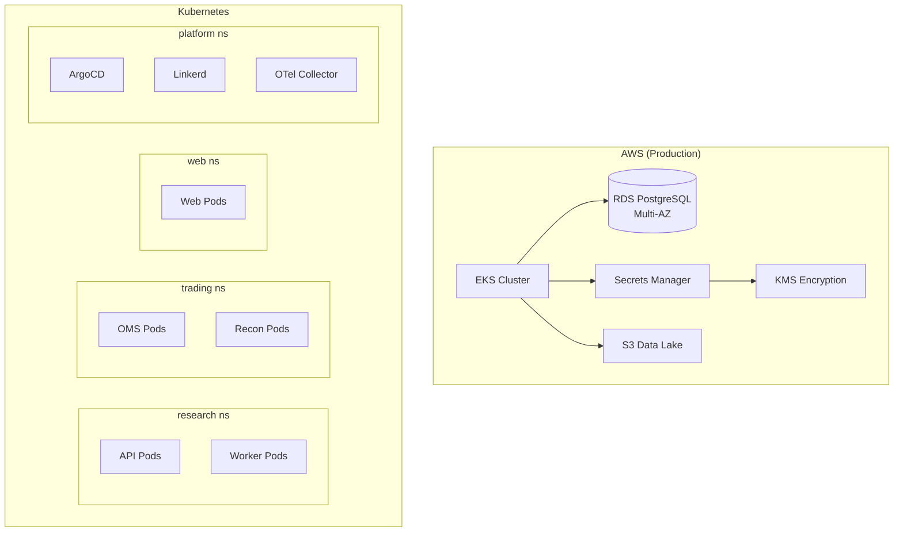

# Architecture

## System Overview

## Service Boundaries

| Service | Namespace | Port | Responsibility |
|---------|-----------|------|----------------|
| API | research | 8000 | Research, features, agents, recommendations, HITL |
| OMS | trading | 8000 | Orders, positions, kill switches, reconciliation |
| Workers | research | — | Market data ingestion, nightly jobs, streaming |
| Recon Worker | trading | — | Broker reconciliation (5s cadence) |
| Web | web | 3000 | Operator terminal UI |

## Data Flow: Order Lifecycle

## Data Flow: Daily Recommendation Pipeline

## Infrastructure

## Key Design Principles

1. **LLM ↔ Broker isolation:** AI agents cannot directly submit orders. Enforced at import level in CI.
2. **Event sourcing for orders:** Every state transition is an immutable event. Full audit trail.
3. **PIT-correct features:** All feature queries respect point-in-time semantics. No lookahead bias.
4. **Kill switches at every level:** Global, account, and strategy scopes. Recon worker auto-arms on drift.
5. **Observability from day 1:** Structured logs, distributed traces, Prometheus metrics on every service.
