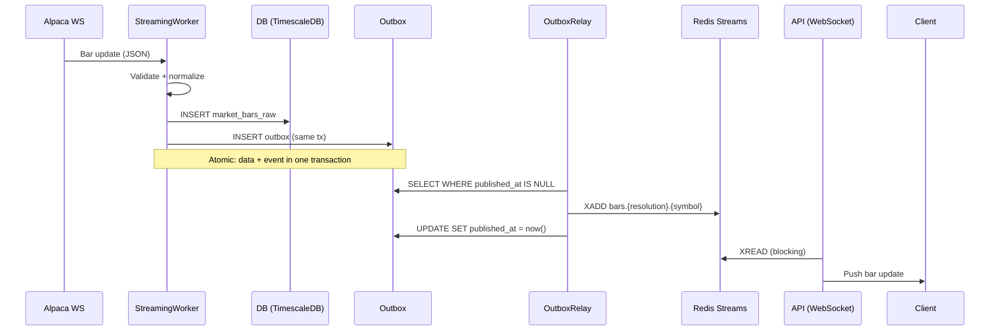
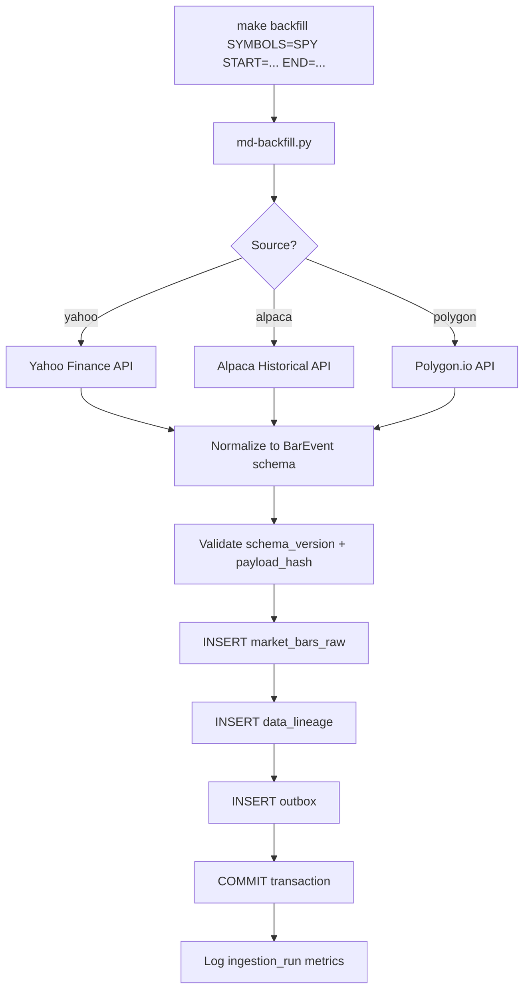
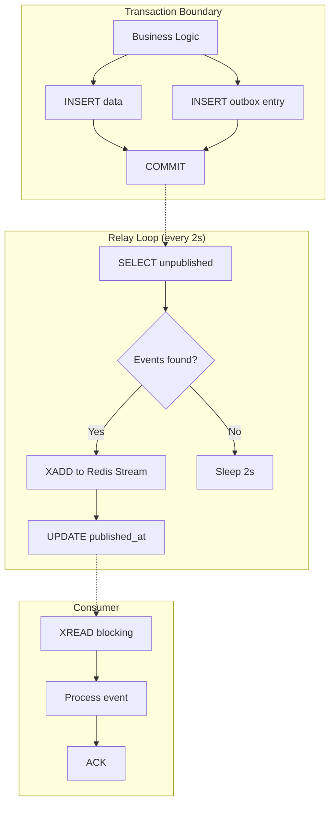
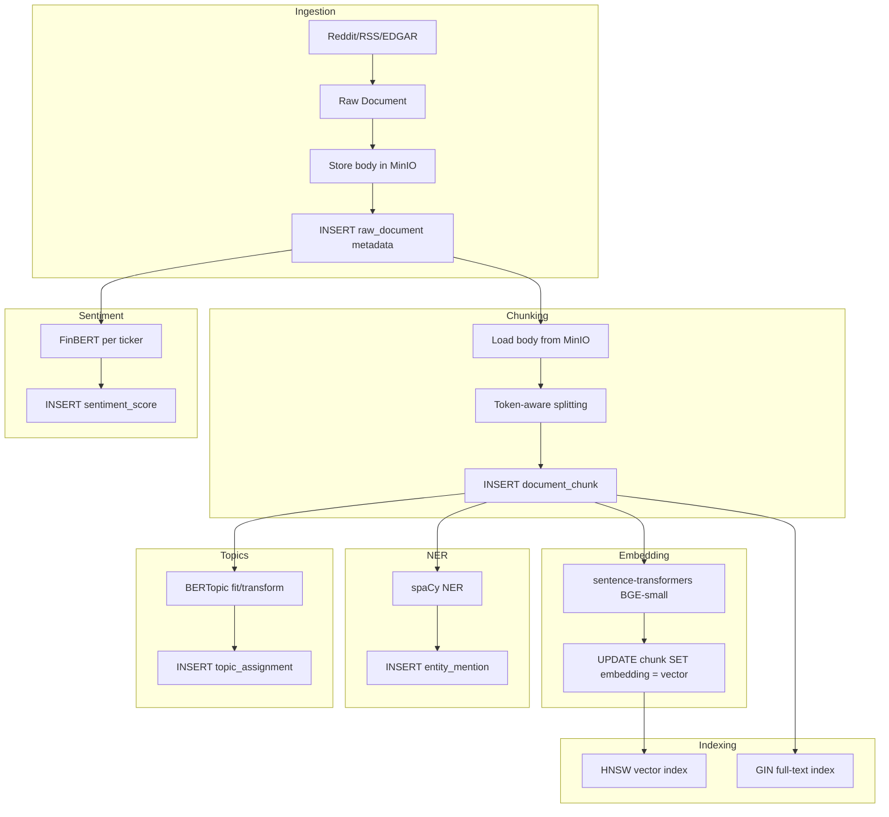
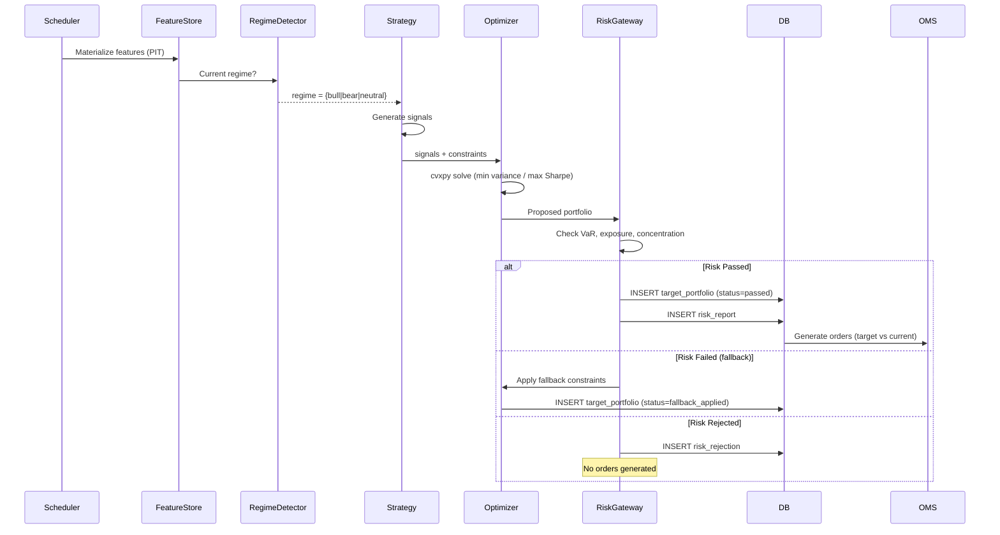
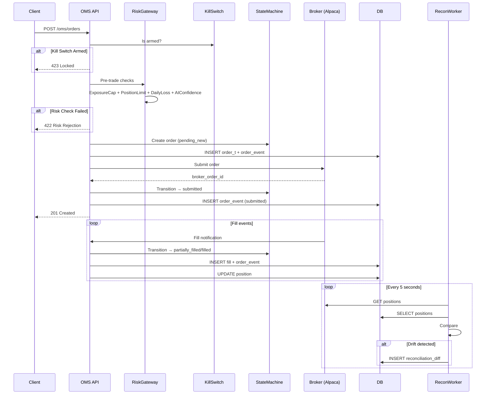
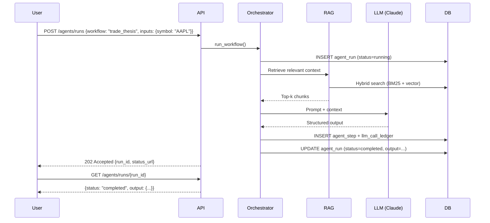

# Data Flow

## Overview

Astraeus processes data through several distinct flows:
1. **Real-time streaming** — Live market bars via WebSocket
2. **Batch ingestion** — Historical backfill and nightly jobs
3. **Event-driven** — Outbox pattern for reliable inter-service communication
4. **NLP pipeline** — Document ingestion → chunking → embedding → indexing
5. **Portfolio pipeline** — Signals → optimization → risk check → execution

## Real-Time Market Data Flow

## Batch Ingestion Flow

## Outbox Relay Pattern

**Design Decisions:**
- Outbox guarantees at-least-once delivery (no lost events)
- Redis Streams provide consumer groups for fan-out
- 2-second relay interval balances latency vs DB load
- If Redis is unavailable, relay logs events and retries

## NLP Pipeline Flow

## Portfolio Construction Pipeline

## Order Execution Flow

## AI Copilot Flow

## Topic Naming Convention

Events are published to Redis Streams with structured topic names:

| Topic Pattern | Example | Description |
|---------------|---------|-------------|
| `bars.{resolution}.{symbol}` | `bars.1d.AAPL` | Price bar events |
| `ticks.{symbol}` | `ticks.SPY` | Tick-level events |
| `corporate_actions.{symbol}` | `corporate_actions.TSLA` | Splits, dividends |
| `fundamentals.{symbol}` | `fundamentals.MSFT` | Fundamental data |
| `macro.{indicator}` | `macro.GDP` | Macroeconomic indicators |
| `dlq.{original_topic}` | `dlq.bars.1d.AAPL` | Dead letter queue |
