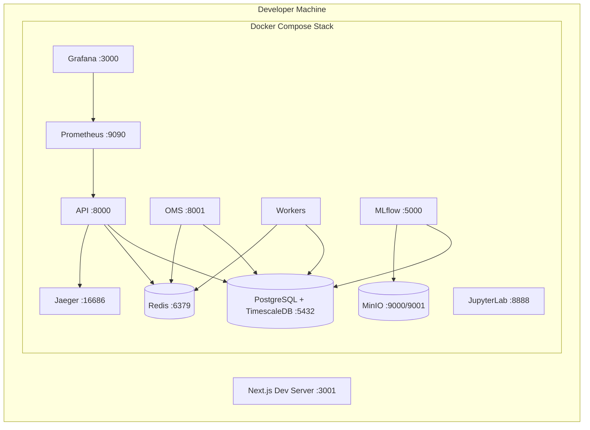
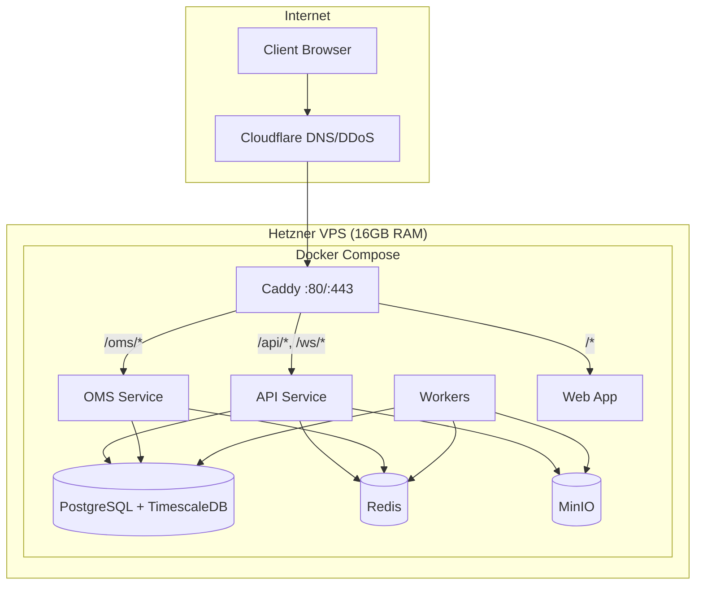
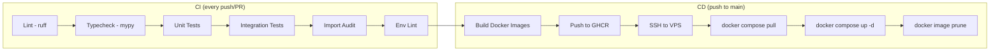
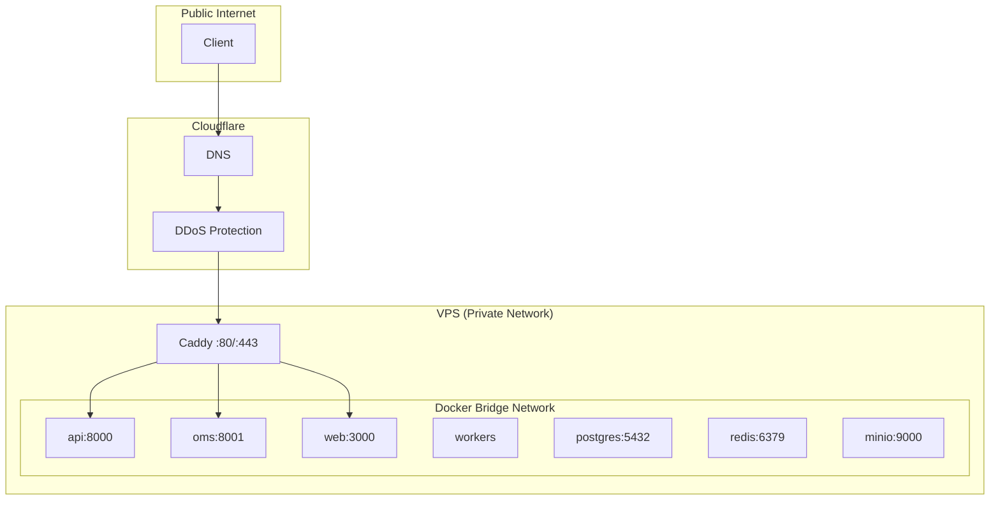

# Deployment Architecture

## Environments

| Environment | Purpose | Infrastructure |
|-------------|---------|---------------|
| Local | Development | Docker Compose on developer machine |
| CI | Automated testing | GitHub Actions runners |
| Production | Live system | Single Hetzner VPS (16GB RAM) |

## Local Development Architecture



**Docker Compose Files:**
- `infra/docker/compose.yml` — Base services (Postgres, Redis, MinIO, Jaeger, Prometheus, Grafana)
- `infra/docker/compose.override.yml` — Dev overrides (port mappings, API/Workers build, MLflow, JupyterLab)

**Startup Command:** `make dev` (builds images, starts stack, runs MinIO init, verifies health)

## Production Architecture



**Production Compose:** `infra/docker/compose.prod.yml`

**Resource Limits:**
| Service | Memory Limit |
|---------|:------------:|
| API | 1 GB |
| OMS | 512 MB |
| Workers | 4 GB |
| Web | 512 MB |
| PostgreSQL | 4 GB |
| Redis | 512 MB |

## Docker Images

| Image | Base | Build Context | Registry |
|-------|------|---------------|----------|
| `astraeus-api` | `python:3.12-slim` | `apps/api/Dockerfile` | `ghcr.io/{owner}/astraeus-api` |
| `astraeus-workers` | `python:3.12-slim` | `apps/workers/Dockerfile` | `ghcr.io/{owner}/astraeus-workers` |
| `astraeus-web` | Node.js | `apps/web/Dockerfile` | `ghcr.io/{owner}/astraeus-web` |
| `astraeus-oms` | Shares `astraeus-api` image | Same as API | Same as API |

**Multi-stage Build (API example):**
1. **Builder stage:** Install uv, sync dependencies (frozen lockfile, no dev deps)
2. **Runtime stage:** Copy venv, create non-root user, expose port, set healthcheck

**Security Hardening:**
- Non-root user (`astraeus:astraeus`)
- Minimal base image (`python:3.12-slim`)
- No dev dependencies in production
- Built-in healthcheck via Python urllib

## Caddy Configuration

```
{$DOMAIN} {
    handle /*        → reverse_proxy web:3000
    handle /api/*    → reverse_proxy api:8000
    handle /ws/*     → reverse_proxy api:8000
    handle /oms/*    → reverse_proxy oms:8001
}
```

**Features:**
- Automatic TLS via Let's Encrypt
- HTTP/2 by default
- WebSocket proxying
- Zero-config HTTPS

## CI/CD Pipeline



**Deployment Steps (deploy.yml):**
1. Build Docker images for api, workers, web (parallel matrix)
2. Push to GitHub Container Registry (GHCR)
3. SSH into production VPS
4. Pull latest images
5. Restart services with `docker compose up -d --remove-orphans`
6. Prune old images

**Infrastructure Lint (infra-lint.yml):**
- Terraform validate (dev, staging, prod)
- TFLint
- Helm lint + template
- kubeconform schema validation
- Policy checks (no `latest` tags, no hardcoded secrets)
- gitleaks secret scanning
- Trivy config scan

## Secrets Management

| Secret | Storage | Rotation |
|--------|---------|----------|
| DB password | `.env.prod` on VPS | Manual |
| JWT secret | `.env.prod` on VPS | Manual |
| MinIO credentials | `.env.prod` on VPS | Manual |
| GitHub token | GitHub Secrets | Automatic |
| VPS SSH key | GitHub Secrets | Manual |
| API keys (Alpaca, etc.) | `.env.prod` on VPS | Manual |

**Safety Mechanisms:**
- Settings model refuses to boot in staging/prod with default dev secrets
- Pre-commit hook: `detect-private-key`
- CI: gitleaks scanning
- `.gitleaks.toml` for allowlist configuration

## Network Topology



**Key Points:**
- Only Caddy exposes ports 80/443 to the internet
- All inter-service communication is on the Docker bridge network
- Database and Redis are not exposed externally in production
- Services reference each other by Docker DNS names

## Kubernetes (Planned — Phase 10)

Infrastructure for Kubernetes deployment is scaffolded:
- Helm charts in `apps/*/deploy/chart/`
- Terraform modules in `infra/terraform/envs/{dev,staging,prod}`
- Kind bootstrap script in `infra/kind/bootstrap.sh`
- GitOps manifests in `gitops/`

**Make targets:**
- `make dev-k8s` — Spin up local kind cluster
- `make helm-lint` — Lint all Helm charts
- `make tf-validate` — Validate Terraform modules
- `make tf-plan` — Plan against dev environment
