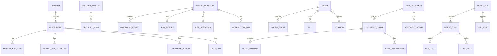

# Domain Model

## Core Business Entities

Astraeus models the quantitative trading domain with the following bounded contexts:

1. **Market Data** — Instruments, price bars, corporate actions
2. **Feature Store** — Computed features with point-in-time semantics
3. **Portfolio** — Target portfolios, weights, risk reports
4. **Trading** — Orders, fills, positions, reconciliation
5. **Intelligence** — Documents, embeddings, agent runs, recommendations

## Domain Identifiers (Value Objects)

```python
# From astraeus-domain
Symbol = NewType("Symbol", str)       # e.g., "AAPL", "SPY"
OrderId = NewType("OrderId", UUID)    # Unique order identifier
AccountId = NewType("AccountId", str) # Trading account
StrategyId = NewType("StrategyId", str) # Strategy identifier
RunId = NewType("RunId", UUID)        # AI workflow run
```

## Entity Relationship Diagram



## Aggregates

### Market Data Aggregate

**Root:** `Instrument`

| Entity | Description |
|--------|-------------|
| `Instrument` | Canonical symbol with metadata (exchange, sector, active status) |
| `MarketBarRaw` | Raw OHLCV bar (hypertable, partitioned by time) |
| `MarketBarAdjusted` | Split/dividend-adjusted bar |
| `CorporateAction` | Splits, dividends, mergers |
| `DataGap` | Detected missing data points |
| `DataLineage` | Provenance tracking per ingested record |
| `Outbox` | Transactional outbox for event publishing |

**Business Rules:**
- Bars are deduplicated on `(symbol, ts, resolution, source)`
- Corporate actions trigger full adjustment rebuild for affected symbols
- Gaps are detected by comparing exchange calendar vs actual data
- Compression policy: chunks older than 30 days are compressed

### Portfolio Aggregate

**Root:** `TargetPortfolio`

| Entity | Description |
|--------|-------------|
| `TargetPortfolio` | Versioned target allocation per strategy per day |
| `PortfolioWeight` | Per-asset weight within a portfolio |
| `RiskReport` | VaR, CVaR, stress scenarios, factor exposure |
| `RiskRejection` | Structured rejection with failed checks |
| `AttributionRun` | Factor-model or Brinson PnL decomposition |
| `FactorReturns` | Cached Ken French factor data (hypertable) |
| `TaskRun` | Idempotency tracking for pipeline tasks |

**Business Rules:**
- Weights must sum to ≤ 1.0 (allows cash allocation)
- Individual weight range: [-1.0, 1.0] (allows short positions)
- Portfolio status: `passed`, `fallback_applied`, or `rejected`
- Versioning: same strategy+date can have multiple versions
- Attribution methods: `factor_ff5_mom` or `brinson`

### Trading Aggregate

**Root:** `Order`

| Entity | Description |
|--------|-------------|
| `Order` (order_t) | Order record with state machine |
| `OrderEvent` | Append-only event log (event sourcing) |
| `Fill` | Individual fill records |
| `Position` | Current position snapshot per account/symbol |
| `ReconciliationDiff` | Detected drift between local and broker |
| `KillSwitchState` | Kill switch state per scope |
| `TradeJournal` | Append-only audit log (UPDATE/DELETE revoked) |

**Business Rules:**
- Orders are idempotent on `client_order_id`
- State transitions follow a strict state machine (see architecture-overview.md)
- Kill switch prevents all order submission when armed
- Trade journal is append-only (enforced at DB level)
- Reconciliation runs every 5 seconds

### Intelligence Aggregate

**Root:** `AgentRun`

| Entity | Description |
|--------|-------------|
| `AgentRun` | Top-level workflow execution |
| `AgentStep` | Per-agent step within a run |
| `LLMCallLedger` | Every LLM API call with cost/token tracking |
| `ToolCallLedger` | Every tool invocation |
| `PromptRegistry` | Versioned prompts with lifecycle (draft → promoted) |
| `HITLQueue` | Human-in-the-loop approval items |

**Business Rules:**
- Runs have a cost budget (`max_cost_usd`, default $0.50)
- Runs have a timeout (`timeout_s`, default 60s)
- HITL items expire after a configurable TTL
- Prompt versions follow a lifecycle: draft → promoted → deprecated

### NLP/Alt-Data Aggregate

**Root:** `RawDocument`

| Entity | Description |
|--------|-------------|
| `RawDocument` | Immutable document metadata (body stored in MinIO) |
| `DocumentChunk` | Token-aware text chunks with pgvector embeddings |
| `EntityMention` | NER-detected entity spans |
| `SentimentScore` | Per-doc per-ticker FinBERT sentiment |
| `TopicAssignment` | BERTopic topic assignments per chunk |
| `TopicModelRun` | BERTopic refit metadata |

**Business Rules:**
- Documents are deduplicated on `(source, source_doc_id)`
- Chunks use 384-dimensional embeddings (BGE-small-en-v1.5)
- HNSW index for approximate nearest neighbor search
- Full-text search via GIN index on `to_tsvector('english', text)`
- Point-in-time: `available_at = max(publish_ts, ingest_ts)`

## Domain Events

| Event | Source | Consumers |
|-------|--------|-----------|
| `BarEvent` | Market data ingestion | Feature store, streaming clients |
| `CorporateActionEvent` | Market data ingestion | Adjustment worker |
| `SignalEvent` | Strategy engine | Portfolio optimizer |
| `DocumentIngestedEvent` | Alt-data ingestion | NLP pipeline |
| `DocumentProcessedEvent` | NLP pipeline | RAG index, feature store |
| `SentimentFeatureEvent` | NLP pipeline | Feature store |

## Enumerations

### OrderState
```
pending_new → submitted → partially_filled → filled
                       → pending_cancel → cancelled
           → rejected
```

### Environment
```
local | ci | staging | prod
```

### Role (RBAC)
```
viewer | analyst | operator | service
```

### Resolution (Market Data)
```
1m | 5m | 15m | 1h | 1d
```

### AssetClass
```
equity | etf | crypto | forex | commodity
```
