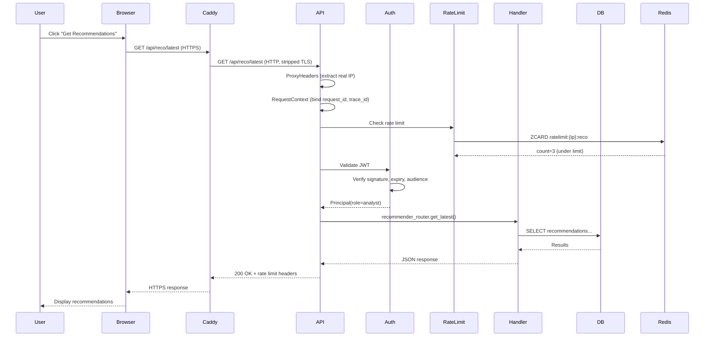
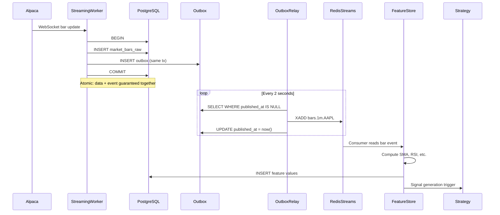
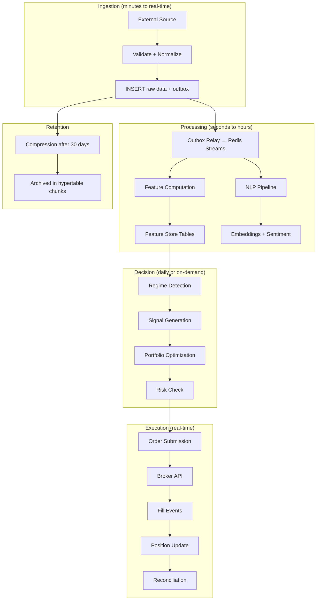

# Knowledge Transfer Guide

## Executive Summary

### What the System Does

Astraeus is an AI-powered quantitative trading and research platform that:
- Ingests real-time and historical market data from multiple sources
- Runs NLP pipelines on alternative data (Reddit, RSS, SEC filings)
- Constructs optimized portfolios with risk management
- Executes trades via broker APIs with pre-trade risk checks
- Provides an AI copilot for trade research and analysis
- Reconciles positions against broker state every 5 seconds

### Why It Exists

To provide institutional-grade quantitative trading infrastructure to a solo engineer or small team at minimal cost (~$30/month), eliminating the need for expensive Bloomberg terminals, dedicated quant infrastructure teams, or enterprise trading platforms.

### Business Value

- **Cost efficiency:** Runs on a single $18/month VPS
- **Full-stack:** Replaces 5-10 separate tools/services
- **AI-native:** LLM-powered research assistant built in
- **Risk-managed:** Multiple layers of protection against trading errors
- **Observable:** Full audit trail, traces, and metrics

---

## Architectural Walkthrough

### End-to-End Request Journey

### End-to-End Event Journey (Market Data)

### Data Lifecycle

---

## Deep Dive Sessions

### Session 1: Backend Architecture

**Duration:** 60 minutes

**Topics:**
1. FastAPI application factory pattern (`apps/api/astraeus_api/app.py`)
2. Middleware stack (proxy headers → request context → rate limiting)
3. Dependency injection (settings, DB session, auth)
4. Error handling (AstraeusError → RFC 7807 Problem Details)
5. Observability wiring (structlog + OTel + Prometheus)

**Key Files:**
- `apps/api/astraeus_api/app.py` — Application factory
- `apps/api/astraeus_api/middleware.py` — Request context
- `apps/api/astraeus_api/rate_limit.py` — Rate limiting
- `libs/config/astraeus_config/base.py` — Settings model
- `libs/observability/astraeus_observability/` — Logging, tracing, metrics

### Session 2: Database & Data Model

**Duration:** 45 minutes

**Topics:**
1. Two-database architecture (OLTP + research)
2. TimescaleDB hypertables and compression
3. pgvector for embeddings
4. Bitemporal modeling (event_ts + knowledge_ts)
5. Outbox pattern implementation
6. Migration strategy (phased, 12 versions)

**Key Files:**
- `libs/db/astraeus_db/migrations/versions/` — All migrations
- `infra/docker/postgres/init.sql` — Database initialization
- `libs/config/astraeus_config/base.py` — DatabaseSettings

### Session 3: Trading Infrastructure

**Duration:** 60 minutes

**Topics:**
1. Event-sourced order state machine
2. Pre-trade risk gateway (4 rules)
3. Circuit breaker pattern
4. Kill switch mechanism
5. Reconciliation loop (5-second cycle)
6. Broker adapter abstraction

**Key Files:**
- `libs/trading/astraeus_trading/` — State machine, events, journal
- `libs/risk/astraeus_risk/` — Risk gateway, circuit breaker
- `libs/brokers/astraeus_brokers/` — Broker adapters
- `apps/oms/astraeus_oms/` — OMS service

### Session 4: AI/ML Pipeline

**Duration:** 45 minutes

**Topics:**
1. NLP pipeline (sentiment → NER → embeddings → topics)
2. RAG retrieval (hybrid BM25 + vector with RRF)
3. Agent runtime (workflow orchestrator, cost tracking)
4. Prompt registry and versioning
5. Human-in-the-loop approval flow
6. LLM cost ledger

**Key Files:**
- `libs/nlp/astraeus_nlp/` — NLP pipeline
- `libs/rag/astraeus_rag/` — RAG retrieval
- `libs/agent_runtime/astraeus_agent_runtime/` — Agent framework
- `apps/api/astraeus_api/routes/agents.py` — Agent API

### Session 5: Infrastructure & Deployment

**Duration:** 30 minutes

**Topics:**
1. Docker multi-stage builds
2. Docker Compose (dev vs prod)
3. CI/CD pipeline (GitHub Actions → GHCR → SSH deploy)
4. Caddy reverse proxy and auto-TLS
5. Secrets management
6. Monitoring and alerting

**Key Files:**
- `apps/api/Dockerfile` — Multi-stage build
- `infra/docker/compose.prod.yml` — Production stack
- `.github/workflows/deploy.yml` — CD pipeline
- `infra/docker/caddy/Caddyfile` — Routing

### Session 6: Security

**Duration:** 30 minutes

**Topics:**
1. JWT authentication flow
2. RBAC permission model
3. Rate limiting (Redis sliding window)
4. Supply chain hardening (SHA-pinned actions)
5. Secret validation (fail-fast on defaults)
6. Import isolation (LLM ↔ Broker boundary)

---

## Interview Questions (KT Verification)

### Architecture

1. **Q:** Why does Astraeus use a single PostgreSQL instance instead of separate databases for time-series and OLTP?
   **A:** Operational simplicity. TimescaleDB extension provides time-series capabilities within PostgreSQL, avoiding the need to manage a separate InfluxDB/ClickHouse. pgvector adds vector search. One database to backup, monitor, and maintain.

2. **Q:** Why Redis Streams instead of Kafka for event streaming?
   **A:** Cost and operational simplicity. Redis is already needed for caching and rate limiting. Streams provide consumer groups and persistence. The system targets ~500 users on a single VPS — Kafka's throughput guarantees aren't needed at this scale.

3. **Q:** Why is the outbox pattern used instead of direct event publishing?
   **A:** Atomicity. The outbox ensures that data writes and event publications are in the same transaction. If the service crashes after writing data but before publishing, the relay picks it up. This guarantees at-least-once delivery without distributed transactions.

### Trading

4. **Q:** What happens if the kill switch is armed while orders are in-flight?
   **A:** In-flight orders continue their lifecycle (fills still process). Only new order submissions are blocked. The kill switch is a gate on the entry point, not a cancel-all mechanism.

5. **Q:** How does the reconciliation worker handle a position mismatch?
   **A:** It records the diff in `reconciliation_diff` with local and broker representations. It does NOT auto-correct. Resolution is manual or via a separate process that determines which side is authoritative.

6. **Q:** Why is the trade journal append-only at the database level?
   **A:** Audit compliance. By revoking UPDATE/DELETE at the PostgreSQL level, no application code (even buggy code) can alter the historical record. This provides a tamper-evident audit trail.

### Data

7. **Q:** What is "point-in-time" correctness and why does it matter?
   **A:** PIT ensures that when you query "what did we know at time T?", you get exactly what was available then — not data that arrived later. This prevents lookahead bias in backtesting. Implemented via bitemporal columns (event_ts + knowledge_ts).

8. **Q:** How are corporate actions handled for historical data?
   **A:** When a corporate action is detected, the nightly worker rebuilds `market_bars_adjusted` for the affected symbol. Raw bars are never modified. The adjustment hash tracks which action set was applied.

### Security

9. **Q:** What prevents the system from running in production with development secrets?
   **A:** The `Settings` model validator checks `ASTRAEUS_ENV` at startup. If env is `staging` or `prod` and any secret matches the known development default, the process raises `ValueError` and refuses to start.

10. **Q:** How does rate limiting work across multiple API replicas?
    **A:** Redis-backed sliding window. All replicas share the same Redis sorted set keys, so rate limits are global. If Redis is unavailable, each replica falls back to per-process in-memory limiting (fail-open).

---

## System Risks

### Technical Debt

| Area | Debt | Impact | Priority |
|------|------|--------|----------|
| OMS | Synchronous workflow execution (should be task queue) | Blocks API thread during AI runs | Medium |
| Auth | Single shared JWT secret (not OIDC) | Can't revoke individual tokens | Low (single-user) |
| Streaming | Single worker instance (no sharding) | Can't scale beyond one WS connection | Low |
| Frontend | API client not auto-generated in CI | Manual sync needed | Low |

### Known Limitations

1. **Single point of failure** — One VPS, no HA. Acceptable for the target scale.
2. **No message replay** — Redis Streams don't retain indefinitely. If a consumer is down too long, events are lost.
3. **CPU-bound ML** — Python GIL limits NLP throughput. Mitigated by running ML in workers (separate process).
4. **No blue-green deploys** — Docker Compose restarts cause brief downtime during deploys.

### Scalability Bottlenecks

| Bottleneck | Threshold | Mitigation |
|------------|-----------|------------|
| PostgreSQL connections | ~100 concurrent | Increase pool, add PgBouncer |
| Redis memory | 512MB limit | Increase limit, add eviction |
| Single VPS CPU | ~500 concurrent users | Vertical scale or migrate to K8s |
| Outbox relay throughput | ~1000 events/sec | Batch larger, reduce interval |

### Reliability Concerns

1. **Outbox relay single-writer** — If workers crash, events accumulate but don't publish until restart
2. **Reconciliation gap** — 5-second window where local and broker state can diverge
3. **No dead letter queue processing** — DLQ events are written but not automatically retried

### Future Improvements

1. **Kubernetes migration** — Helm charts and Terraform are scaffolded (Phase 10)
2. **OIDC authentication** — Replace shared JWT with proper identity provider
3. **Task queue** — Replace synchronous AI execution with Celery/ARQ
4. **Blue-green deploys** — Zero-downtime deployments
5. **Multi-region** — Read replicas for global access
6. **OTel Collector** — Fan-out traces to multiple backends, tail-based sampling
