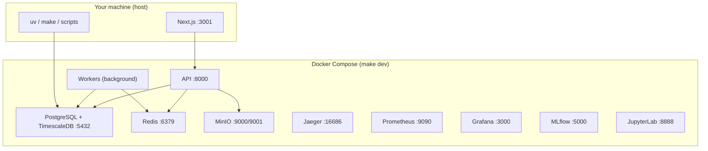

# Astraeus — Local Setup Guide

Complete step-by-step instructions to run Astraeus on your local machine. This document covers prerequisites, first-time setup, every service that starts, optional integrations (API keys), frontend configuration, verification, and troubleshooting.

> **Quick path:** If you already have Docker, Git, and `uv` installed, run `./scripts/bootstrap.sh` then `make dev`, and verify with `curl http://localhost:8000/healthz`.

---

## Table of Contents

1. [What You Are Running](#1-what-you-are-running)
2. [System Requirements](#2-system-requirements)
3. [Prerequisites](#3-prerequisites)
4. [Platform-Specific Installation](#4-platform-specific-installation)
5. [First-Time Setup (Step by Step)](#5-first-time-setup-step-by-step)
6. [What `make dev` Does](#6-what-make-dev-does)
7. [Service URLs and Credentials](#7-service-urls-and-credentials)
8. [Frontend Setup (Next.js)](#8-frontend-setup-nextjs)
9. [Optional Services (OMS, Recon Worker)](#9-optional-services-oms-recon-worker)
10. [Integrations and API Keys](#10-integrations-and-api-keys)
11. [Environment Variables Reference](#11-environment-variables-reference)
12. [First Steps After Setup](#12-first-steps-after-setup)
13. [Development Workflow](#13-development-workflow)
14. [Common Commands](#14-common-commands)
15. [Troubleshooting](#15-troubleshooting)
16. [Minimal Stack (Low RAM)](#16-minimal-stack-low-ram)

---

## 1. What You Are Running

Astraeus is a **uv workspace monorepo** — one Git repository containing:

| Layer | Location | Technology |
|-------|----------|------------|
| Backend apps | `apps/api`, `apps/oms`, `apps/workers`, `apps/recon_worker` | Python 3.12, FastAPI, Uvicorn |
| Shared libraries | `libs/*` (22 packages) | Domain logic, DB, NLP, trading, etc. |
| Frontend | `apps/web` | Next.js 16, React 19, TypeScript, Tailwind CSS 4 |
| Infrastructure | `infra/docker/` | Docker Compose |

**Local dev architecture:** Docker Compose runs the data plane (Postgres, Redis, MinIO), observability stack, research sandbox, API, and background workers. The **web frontend runs separately** on your host via `npm run dev`.



---

## 2. System Requirements

| Resource | Minimum | Recommended |
|----------|---------|-------------|
| **RAM** | 8 GB | 16 GB |
| **Disk** | 10 GB free | 15 GB+ (first Docker pull is ~5 GB) |
| **CPU** | 4 cores | 8 cores (NLP/ML workloads benefit) |
| **OS** | Windows 10/11 (WSL 2), macOS, or Linux | — |

### Ports Used Locally

Ensure these ports are free before starting:

| Port | Service |
|------|---------|
| 3000 | Grafana |
| 3001 | Next.js dev server (auto-selected when 3000 is taken) |
| 4317, 4318 | Jaeger OTLP |
| 5000 | MLflow |
| 5432 | PostgreSQL |
| 6379 | Redis |
| 8000 | API |
| 8001 | OMS (only if you run it manually — see [§9](#9-optional-services-oms-recon-worker)) |
| 8888 | JupyterLab |
| 9000, 9001 | MinIO (API + console) |
| 9090 | Prometheus |
| 16686 | Jaeger UI |

---

## 3. Prerequisites

Install these **before** cloning the repository.

| Tool | Version | Purpose | Install |
|------|---------|---------|---------|
| **Git** | any | Clone the repo | [git-scm.com](https://git-scm.com/) |
| **Docker Desktop** | ≥ 24.0 | Runs Postgres, Redis, API containers, etc. | [docker.com/products/docker-desktop](https://www.docker.com/products/docker-desktop/) |
| **uv** | ≥ 0.6.0 | Python 3.12 + dependency management | [docs.astral.sh/uv](https://docs.astral.sh/uv/getting-started/installation/) |
| **Make** | any | Task runner (`make dev`, `make test`, …) | Pre-installed on macOS/Linux; `choco install make` on Windows |
| **Node.js** | ≥ 20 | Frontend only | [nodejs.org](https://nodejs.org/) (optional until you work on `apps/web`) |

### Verify Prerequisites

```bash
git --version
docker --version
docker compose version
uv --version          # expect 0.6.x+
make --version        # optional on Windows if using WSL
node --version        # v20+ (frontend only)
```

**Docker must be running** before `make dev`. On Docker Desktop, confirm the whale icon is active in the system tray/menu bar.

---

## 4. Platform-Specific Installation

### Windows (Recommended: WSL 2)

WSL 2 provides a Linux environment inside Windows. This is the **recommended** approach — shell scripts (`bootstrap.sh`, `verify-stack.sh`) and `make` work reliably.

#### Step 1 — Install WSL 2

Open **PowerShell as Administrator**:

```powershell
wsl --install
```

Restart your computer. Ubuntu opens on first boot — create a username and password.

#### Step 2 — Install Docker Desktop

1. Download [Docker Desktop for Windows](https://www.docker.com/products/docker-desktop/).
2. During install, enable **"Use WSL 2 based engine"**.
3. After install: **Docker Desktop → Settings → Resources → WSL Integration** → enable integration for your Ubuntu distro.

#### Step 3 — Install tools inside WSL (Ubuntu terminal)

```bash
# uv (Python package manager)
curl -LsSf https://astral.sh/uv/install.sh | sh
source ~/.bashrc

# Make
sudo apt update && sudo apt install -y make git curl

# Verify
uv --version
docker --version
```

> **Important:** Clone the repo inside the WSL filesystem (`~/Astraeus`), **not** on the Windows mount (`/mnt/c/Users/...`). File I/O on `/mnt/c` is 10–50× slower and can cause Docker build issues.

#### Optional — Increase WSL memory

Create or edit `%USERPROFILE%\.wslconfig`:

```ini
[wsl2]
memory=8GB
processors=4
```

Then run `wsl --shutdown` and reopen Ubuntu.

---

### Windows (Native, without WSL)

If you prefer not to use WSL:

1. Install [Git for Windows](https://git-scm.com/download/win) (includes Git Bash).
2. Install [Docker Desktop](https://www.docker.com/products/docker-desktop/).
3. Install uv from [docs.astral.sh/uv — Windows](https://docs.astral.sh/uv/getting-started/installation/#windows).
4. Install Make: `choco install make` (requires [Chocolatey](https://chocolatey.org/)).
5. Use **Git Bash** for all commands below.

> Some shell scripts may behave differently in Git Bash. WSL 2 is strongly recommended.

---

### macOS

```bash
# 1. Install Docker Desktop from docker.com — ensure it is running

# 2. Install uv
curl -LsSf https://astral.sh/uv/install.sh | sh
source ~/.zshrc   # or ~/.bashrc

# 3. Verify
uv --version
docker --version
```

---

### Linux (Ubuntu/Debian)

```bash
# Docker
curl -fsSL https://get.docker.com | sh
sudo usermod -aG docker $USER
# Log out and back in for group membership

# uv
curl -LsSf https://astral.sh/uv/install.sh | sh
source ~/.bashrc

# Make (if missing)
sudo apt update && sudo apt install -y make git curl
```

---

## 5. First-Time Setup (Step by Step)

### Step 1 — Clone the repository

```bash
git clone https://github.com/SahilSatyam/Astraeus.git
cd Astraeus
```

### Step 2 — Run bootstrap

```bash
./scripts/bootstrap.sh
```

This script is **idempotent** (safe to re-run). It:

1. Copies `.env.example` → `.env` (only if `.env` does not exist).
2. Installs Python **3.12** via uv.
3. Syncs all workspace packages and dev dependencies (`uv sync --all-packages`).
4. Installs **pre-commit** git hooks (ruff, mypy, gitleaks, env-lint).

Expected output ends with:

```
Bootstrap complete. Next steps:

  make dev        # bring up the local stack
  make smoke      # verify stack health
  make test       # run unit tests
```

### Step 3 — Start the full stack

```bash
make dev
```

**First run takes 2–5 minutes** (downloads ~5 GB of Docker images). Subsequent starts take ~15 seconds.

### Step 4 — Verify the stack

```bash
curl http://localhost:8000/healthz
# {"status":"ok","service":"api","version":"0.1.0-dev"}

# Or run the full smoke test
make smoke
```

### Step 5 — (Optional) Start the frontend

In a **second terminal**:

```bash
cd apps/web
npm install        # first time only
npm run dev        # http://localhost:3001 (Grafana uses 3000)
```

### Step 6 — (Optional) Configure integrations

The stack runs without API keys. Add keys to `.env` when you need live market data, AI copilot, or Reddit ingestion — see [§10](#10-integrations-and-api-keys).

---

## 6. What `make dev` Does

`make dev` executes these steps in order:

| Step | Command / Action | What happens |
|------|------------------|--------------|
| 1 | `docker compose build` | Builds `astraeus/api:dev` and `astraeus/workers:dev` images |
| 2 | `docker compose up -d --wait` | Starts all services; waits for health checks |
| 3 | `minio-init` (profile `init`) | Creates MinIO buckets: `astraeus-research`, `astraeus-artifacts`, `astraeus-data-lake` |
| 4 | `./scripts/verify-stack.sh` | Smoke-tests API, Jaeger, Prometheus, Grafana endpoints |

### Services started by default

| Service | Image / Build | Notes |
|---------|---------------|-------|
| **postgres** | `timescale/timescaledb:2.15.0-pg16` | DBs: `astraeus`, `astraeus_research`; extensions via init scripts |
| **redis** | `redis:7.2-alpine` | AOF persistence enabled |
| **minio** | `minio/minio` | S3-compatible object storage |
| **jaeger** | `jaegertracing/all-in-one:1.58` | OpenTelemetry trace collector |
| **prometheus** | `prom/prometheus:v2.53.0` | Metrics scrape |
| **grafana** | `grafana/grafana:11.1.0` | Dashboards |
| **api** | Built from `apps/api/Dockerfile` | Runs Alembic migrations, then Uvicorn on :8000 |
| **workers** | Built from `apps/workers/Dockerfile` | Outbox relay, nightly jobs, optional Alpaca streaming |
| **mlflow** | `ghcr.io/mlflow/mlflow:v2.14.0` | Experiment tracking (dev override only) |
| **jupyterlab** | `jupyter/scipy-notebook:python-3.12` | Research notebooks (dev override only) |

### Database initialization (automatic)

On first `make dev`:

1. **PostgreSQL** starts with user/password `astraeus`/`astraeus`.
2. `infra/docker/postgres/init.sql` creates the `astraeus_research` database.
3. `infra/docker/postgres/timescale.sh` enables TimescaleDB.
4. **API startup** runs `alembic upgrade head` — creates all tables, hypertables, pgvector columns.

You do **not** need to install PostgreSQL, Redis, or MinIO on your host.

---

## 7. Service URLs and Credentials

| Service | URL | Credentials |
|---------|-----|-------------|
| **API health** | http://localhost:8000/healthz | — |
| **API docs (Swagger)** | http://localhost:8000/docs | — |
| **API docs (ReDoc)** | http://localhost:8000/redoc | — |
| **API metrics** | http://localhost:8000/metrics | — |
| **Grafana** | http://localhost:3000 | `admin` / `astraeus` |
| **Jaeger** | http://localhost:16686 | — |
| **Prometheus** | http://localhost:9090 | — |
| **MinIO Console** | http://localhost:9001 | `astraeus` / `astraeus123` |
| **MinIO S3 API** | http://localhost:9000 | same as above |
| **MLflow** | http://localhost:5000 | — |
| **JupyterLab** | http://localhost:8888 | No token/password (local dev) |
| **Next.js (frontend)** | http://localhost:3001 | See [§8](#8-frontend-setup-nextjs) |

### Direct database access

```bash
# PostgreSQL (inside container)
docker exec -it astraeus-postgres-1 psql -U astraeus -d astraeus

# From host (if psql is installed)
psql -h localhost -p 5432 -U astraeus -d astraeus
# Password: astraeus

# Redis
docker exec -it astraeus-redis-1 redis-cli
```

GUI tools ([DBeaver](https://dbeaver.io/), [pgAdmin](https://www.pgadmin.org/)): connect to `localhost:5432`, user `astraeus`, password `astraeus`, database `astraeus`.

---

## 8. Frontend Setup (Next.js)

The frontend is **not** part of `make dev`. Run it separately for the operator terminal UI.

### Install and start

```bash
cd apps/web
npm install
npm run dev
```

Next.js detects that port 3000 is used by Grafana and typically binds to **http://localhost:3001**. Check the terminal output for the exact URL.

### Frontend environment variables

Create `apps/web/.env.local` (gitignored) for local overrides:

```env
# Backend API (browser-side requests)
NEXT_PUBLIC_API_URL=http://localhost:8000
NEXT_PUBLIC_WS_URL=ws://localhost:8000/ws

# NextAuth — MUST match ASTRAEUS_AUTH_JWT_SECRET in root .env
NEXTAUTH_SECRET=change-me-in-production
NEXTAUTH_URL=http://localhost:3001

# Login credentials (defaults shown)
AUTH_USERNAME=operator
AUTH_PASSWORD=astraeus

# Server-side BFF proxy target
API_URL=http://localhost:8000

# Optional observability
# NEXT_PUBLIC_SENTRY_DSN=
# NEXT_PUBLIC_OTEL_ENDPOINT=

# Feature flags (all default to true)
# NEXT_PUBLIC_FF_AI_COPILOT=true
# NEXT_PUBLIC_FF_TRADING=true
```

### Login

Open http://localhost:3001/login and sign in with:

- **Username:** `operator` (or `AUTH_USERNAME`)
- **Password:** `astraeus` (or `AUTH_PASSWORD`)

### Frontend requires backend

The UI loads without the API, but data fetches will fail. Minimum backend: `make dev` (API + Postgres + Redis).

---

## 9. Optional Services (OMS, Recon Worker)

These services exist in the codebase but are **not** started by `make dev`. In production, Caddy routes `/oms/*` to the OMS service on port 8001.

| Service | Port | Started by `make dev`? |
|---------|------|:----------------------:|
| API | 8000 | Yes |
| OMS | 8001 | **No** |
| Workers | — | Yes |
| Recon Worker | — | **No** |

### Run OMS locally (for trading UI)

With the Docker stack running (`make dev`):

```bash
# From repo root — uses .env for DB/Redis connection
uv run uvicorn astraeus_oms.app:create_app --factory --host 0.0.0.0 --port 8001 --reload
```

> **Routing note:** The web app's `api-client.ts` sends `/oms/*` requests to `NEXT_PUBLIC_API_URL` (port 8000). In production, Caddy routes `/oms/*` to OMS. For full trading UI locally, either:
> - Call OMS directly at `http://localhost:8001`, or
> - Add a local reverse proxy (e.g. Caddy/nginx) that routes `/oms/*` → `:8001` and everything else → `:8000`.

OMS uses **Alpaca paper trading** when `ASTRAEUS_MD_ALPACA_API_KEY` and `ASTRAEUS_MD_ALPACA_API_SECRET` are set in `.env`.

### Run Recon Worker locally

```bash
uv run python -m astraeus_recon_worker.main
```

---

## 10. Integrations and API Keys

**No API keys are required** for a basic local run. The table below lists every external integration, what it enables, and how to configure it.

### What works without any keys

| Feature | Notes |
|---------|-------|
| API, health checks, Swagger docs | Full access |
| Database, Redis, MinIO | Default credentials |
| Observability (Jaeger, Prometheus, Grafana) | Pre-provisioned |
| Portfolio optimization, backtests | Use backfilled data |
| Market data backfill | Yahoo Finance — no key needed |
| NLP pipeline | Models download from HuggingFace on first use |
| UI navigation | Frontend loads; API-backed pages need running stack |

### What requires API keys

| Integration | Env variables | Get keys from | Enables |
|-------------|---------------|---------------|---------|
| **Alpaca** (market data + paper trading) | `ASTRAEUS_MD_ALPACA_API_KEY`, `ASTRAEUS_MD_ALPACA_API_SECRET` | [alpaca.markets](https://alpaca.markets/) | Live WebSocket bars, OMS paper orders |
| **Polygon.io** | `ASTRAEUS_MD_POLYGON_API_KEY` | [polygon.io](https://polygon.io/) | Historical market data |
| **Alpha Vantage** | `ASTRAEUS_MD_ALPHAVANTAGE_API_KEY` | [alphavantage.co](https://www.alphavantage.co/support/#api-key) | Fundamentals, forex |
| **FRED** | `ASTRAEUS_MD_FRED_API_KEY` | [fred.stlouisfed.org](https://fred.stlouisfed.org/docs/api/api_key.html) | Economic indicators |
| **Anthropic (Claude)** | `ANTHROPIC_API_KEY` | [console.anthropic.com](https://console.anthropic.com/) | AI copilot / agent workflows |
| **OpenAI (GPT)** | `OPENAI_API_KEY` | [platform.openai.com](https://platform.openai.com/api-keys) | LLM fallback tier |
| **Reddit** | `ASTRAEUS_ALTDATA_REDDIT_CLIENT_ID`, `ASTRAEUS_ALTDATA_REDDIT_CLIENT_SECRET` | [reddit.com/prefs/apps](https://www.reddit.com/prefs/apps) (create "script" app) | Reddit alt-data ingestion |

> **LLM keys:** The agent runtime's `LLMClient` uses the standard SDK environment variables `ANTHROPIC_API_KEY` and `OPENAI_API_KEY`. Add them to your root `.env` file. Production templates also reference `ASTRAEUS_LLM_ANTHROPIC_API_KEY` / `ASTRAEUS_LLM_OPENAI_API_KEY` in `infra/docker/.env.prod.example`.

### How to add keys

1. Edit `.env` in the repo root (created by bootstrap).
2. Paste your keys into the relevant variables.
3. Restart affected services:

```bash
# Restart API and workers to pick up new env vars
docker compose -f infra/docker/compose.yml -f infra/docker/compose.override.yml restart api workers
```

For **host-run** services (API with `--reload`, OMS), restart the process manually.

### Market data providers (no key)

| Source | Used by | Key required? |
|--------|---------|:-------------:|
| Yahoo Finance | `make backfill`, default backfill source | No |
| SEC EDGAR | Alt-data workers | No |
| RSS feeds | Alt-data workers | No |

### NLP / ML models (auto-download)

On first NLP use, these models are downloaded from HuggingFace (no API key):

| Model | Env variable | Default |
|-------|--------------|---------|
| FinBERT (sentiment) | `ASTRAEUS_ALTDATA_SENTIMENT_MODEL` | `ProsusAI/finbert` |
| Embeddings | `ASTRAEUS_ALTDATA_EMBEDDING_MODEL` | `BAAI/bge-small-en-v1.5` |
| spaCy NER | `ASTRAEUS_ALTDATA_SPACY_MODEL` | `en_core_web_sm` |

Install spaCy model manually if auto-download fails:

```bash
uv run python -m spacy download en_core_web_sm
```

Set `ASTRAEUS_ALTDATA_NLP_DEVICE=cuda` in `.env` if you have an NVIDIA GPU and want GPU inference.

### Broker adapters (codebase support)

The `libs/brokers` package includes adapters for **Alpaca**, **IBKR**, and **Binance**. Local OMS uses Alpaca paper trading when Alpaca keys are configured.

---

## 11. Environment Variables Reference

All backend configuration uses the `ASTRAEUS_*` prefix. Nested settings use double underscores (`__`), e.g. `ASTRAEUS_DB__HOST` maps to `Settings.db.host`.

The canonical template is `.env.example`. Bootstrap copies it to `.env`.

### Core (defaults work locally)

| Variable | Default | Description |
|----------|---------|-------------|
| `ASTRAEUS_ENV` | `local` | Environment name |
| `ASTRAEUS_APP_NAME` | `astraeus` | Service identifier in logs |
| `ASTRAEUS_APP_VERSION` | `0.1.0` | Version string |

### Database

| Variable | Default |
|----------|---------|
| `ASTRAEUS_DB_HOST` | `localhost` |
| `ASTRAEUS_DB_PORT` | `5432` |
| `ASTRAEUS_DB_USER` | `astraeus` |
| `ASTRAEUS_DB_PASSWORD` | `astraeus` |
| `ASTRAEUS_DB_NAME` | `astraeus` |

> Inside Docker containers, compose override sets `ASTRAEUS_DB_HOST=postgres` automatically.

### Redis

| Variable | Default |
|----------|---------|
| `ASTRAEUS_REDIS_HOST` | `localhost` |
| `ASTRAEUS_REDIS_PORT` | `6379` |
| `ASTRAEUS_REDIS_PASSWORD` | (empty) |

### MinIO

| Variable | Default |
|----------|---------|
| `ASTRAEUS_MINIO_ENDPOINT` | `localhost:9000` |
| `ASTRAEUS_MINIO_ACCESS_KEY` | `astraeus` |
| `ASTRAEUS_MINIO_SECRET_KEY` | `astraeus123` |

### Observability

| Variable | Default | Tip |
|----------|---------|-----|
| `ASTRAEUS_OBS_LOG_LEVEL` | `INFO` | Set `DEBUG` for verbose logs |
| `ASTRAEUS_OBS_LOG_FORMAT` | `json` | Set `console` for human-readable local logs |
| `ASTRAEUS_OBS_OTLP_ENDPOINT` | `http://localhost:4317` | Jaeger collector |

### Authentication

| Variable | Default | Notes |
|----------|---------|-------|
| `ASTRAEUS_AUTH_ENABLED` | `true` | Set `false` to disable JWT enforcement in dev |
| `ASTRAEUS_AUTH_JWT_SECRET` | `change-me-in-production` | Must match `NEXTAUTH_SECRET` in frontend |

### Useful dev overrides

Add to `.env`:

```env
# Readable logs instead of JSON
ASTRAEUS_OBS_LOG_FORMAT=console

# Skip JWT checks during API exploration
ASTRAEUS_AUTH_ENABLED=false

# Debug SQL
ASTRAEUS_DB_ECHO=true
```

---

## 12. First Steps After Setup

Once `curl http://localhost:8000/healthz` returns OK:

### 1. Explore API documentation

- Swagger UI: http://localhost:8000/docs
- ReDoc: http://localhost:8000/redoc

### 2. View distributed traces

Open http://localhost:16686 → select service **api** → **Find Traces**.

### 3. Check Grafana dashboards

http://localhost:3000 — login `admin` / `astraeus`.

### 4. Backfill market data (no API key)

```bash
make backfill SYMBOLS=SPY,AAPL START=2024-01-01 END=2024-12-31
```

### 5. Open JupyterLab

http://localhost:8888 — notebooks have access to Postgres, MLflow, and MinIO env vars.

### 6. Run unit tests

```bash
make test
```

---

## 13. Development Workflow

### Backend hot-reload (faster iteration)

```bash
make dev   # Start infrastructure + containers

# Stop only the containerized API
docker compose -f infra/docker/compose.yml -f infra/docker/compose.override.yml stop api

# Run API on host with auto-reload
uv run uvicorn astraeus_api.main:app --reload --port 8000
```

Code changes reload instantly without rebuilding Docker images.

### After Python code changes (container mode)

```bash
make dev   # Rebuilds images and restarts

# Or restart one service
docker compose -f infra/docker/compose.yml -f infra/docker/compose.override.yml restart api
```

### Database migrations

```bash
make revision MSG="add my_table"   # Create migration
make migrate                       # Apply migrations
```

### Code quality (run before committing)

```bash
make fmt lint typecheck test
```

Pre-commit hooks run these automatically on `git commit`.

### Add a Python dependency

```bash
cd libs/nlp          # or any package
uv add some-package  # Updates pyproject.toml and uv.lock
```

---

## 14. Common Commands

### Stack management

```bash
make dev       # Build and start full stack
make stop      # Stop containers (keep data)
make down      # Remove containers (keep volumes)
make clean     # Remove containers AND volumes (destructive)
make logs      # Tail all service logs
make ps        # Container status
make smoke     # Re-run health verification
```

### Testing

```bash
make test          # Unit tests (no Docker needed)
make test-int      # Integration tests (needs running stack)
make load-test     # Load test: make load-test DURATION=30 CONCURRENCY=10
```

### Market data

```bash
make backfill SYMBOLS=SPY,AAPL START=2024-01-01 END=2024-12-31
make backfill-universe START=2020-01-01 END=2024-12-31
make replay SOURCE=yahoo START=2024-01-01 END=2024-01-31
```

### Frontend

```bash
cd apps/web
npm run dev          # Dev server
npm run build        # Production build
npm run lint         # ESLint
npm run test         # Vitest
npm run test:e2e     # Playwright (needs running stack)
```

### Utilities

```bash
make generate-client   # TypeScript types from OpenAPI (API must be running)
make backup            # Database backup script
make env-lint          # Verify .env.example parity
```

---

## 15. Troubleshooting

### Stack won't start / port conflicts

```bash
make down
make dev
```

Find what's using a port:

```bash
# Linux / macOS / WSL
lsof -i :5432

# Windows PowerShell
netstat -ano | findstr :5432
```

Change the host port in `infra/docker/compose.override.yml` if needed.

### Database connection errors

```bash
docker ps | grep postgres    # Should show "(healthy)"
make migrate                 # Run migrations manually
```

### Docker out of memory

- **Docker Desktop** → Settings → Resources → set Memory to **8 GB+**.
- **WSL 2:** edit `%USERPROFILE%\.wslconfig` (see [§4](#windows-recommended-wsl-2)).

### MinIO init failed

```bash
docker compose -f infra/docker/compose.yml -f infra/docker/compose.override.yml \
  --profile init run --rm minio-init
```

### `uv` or `make` not found (Windows)

Use WSL 2, or ensure uv is on your PATH and Make is installed via Chocolatey.

### Permission denied on Linux

```bash
sudo usermod -aG docker $USER
# Log out and back in
```

### Pre-commit hooks failing

```bash
make fmt
make precommit-install
```

### Reset everything

```bash
make clean    # WARNING: deletes all local DB/Redis/MinIO data
make dev      # Fresh start
```

### Workers not streaming market data

Check logs:

```bash
docker compose -f infra/docker/compose.yml -f infra/docker/compose.override.yml logs workers
```

If you see `streaming_disabled` with reason `No Alpaca API credentials configured`, add Alpaca keys to `.env` and restart workers.

---

## 16. Minimal Stack (Low RAM)

If you have less than 16 GB RAM, start the full stack then stop non-essential services:

```bash
make dev

docker compose -f infra/docker/compose.yml -f infra/docker/compose.override.yml \
  stop grafana prometheus jaeger mlflow jupyterlab
```

This frees ~1.5 GB. Core services (API, Postgres, Redis, MinIO, Workers) need ~3–4 GB.

---

## Related Documentation

| Document | Contents |
|----------|----------|
| [README.md](../README.md) | Project overview, architecture, FAQ |
| [onboarding-guide.md](./onboarding-guide.md) | Developer onboarding, coding standards |
| [database-guide.md](./database-guide.md) | Schema, migrations, TimescaleDB |
| [hosting-guide.md](./hosting-guide.md) | Production VPS deployment |
| [runbooks.md](./runbooks.md) | Operational procedures |
| [CONTRIBUTING.md](../CONTRIBUTING.md) | Contribution workflow |

---

## Quick Reference Card

```bash
# First time
git clone https://github.com/SahilSatyam/Astraeus.git && cd Astraeus
./scripts/bootstrap.sh
make dev
curl http://localhost:8000/healthz

# Frontend (separate terminal)
cd apps/web && npm install && npm run dev

# Daily dev
make dev          # start stack
make logs         # watch logs
make test         # run tests
make stop         # pause

# Data
make backfill SYMBOLS=SPY START=2024-01-01 END=2024-12-31

# Nuclear reset
make clean && make dev
```
