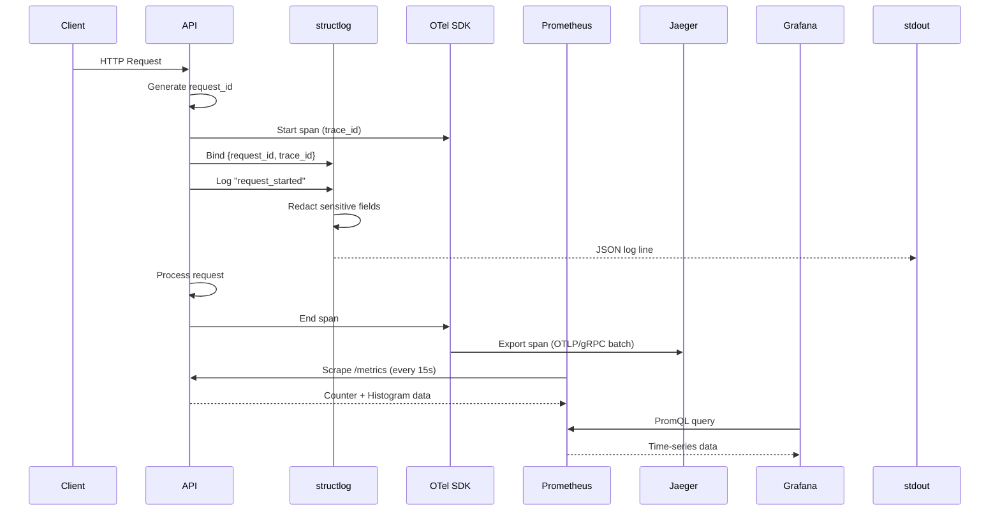

# Observability

## Overview

Astraeus implements the three pillars of observability:
1. **Structured Logging** — structlog with JSON output, context binding
2. **Distributed Tracing** — OpenTelemetry → Jaeger
3. **Metrics** — Prometheus + Grafana dashboards

## Architecture

```mermaid
flowchart TD
    subgraph "Application Services"
        API[API Service]
        OMS[OMS Service]
        Workers[Workers]
    end

    subgraph "Logging"
        SL[structlog]
        JSON[JSON Renderer]
        STDOUT[stdout/stderr]
    end

    subgraph "Tracing"
        OTEL[OpenTelemetry SDK]
        BSP[BatchSpanProcessor]
        OTLP[OTLP/gRPC Exporter]
        Jaeger[Jaeger All-in-One]
    end

    subgraph "Metrics"
        PROM_CLIENT[prometheus-client]
        INSTRUMENTATOR[FastAPI Instrumentator]
        METRICS_EP[/metrics endpoint]
        Prometheus[Prometheus]
        Grafana[Grafana]
    end

    API --> SL --> JSON --> STDOUT
    API --> OTEL --> BSP --> OTLP --> Jaeger
    API --> INSTRUMENTATOR --> METRICS_EP
    Prometheus -->|scrape /metrics| METRICS_EP
    Grafana --> Prometheus
```

## Structured Logging

### Configuration

Logging is configured via `astraeus_observability.configure_logging()`:

```python
configure_logging(settings.observability, service="api")
```

### Processor Chain (order matters)

1. `merge_contextvars` — Merge request-scoped context (request_id, trace_id)
2. `add_log_level` — Promote level to a key
3. `TimeStamper(fmt='iso', utc=True)` — ISO-8601 UTC timestamp
4. `add_logger_name` — Dotted module path
5. `_service_binder` — Attach service name
6. `Redactor` — Scrub sensitive keys (passwords, tokens, secrets)
7. `format_exc_info` — Structured exception rendering
8. `UnicodeDecoder` — Handle encoding
9. **Renderer** — JSON (prod/CI) or ConsoleRenderer (local dev)

### Log Format

**Production (JSON):**
```json
{
  "event": "request_started",
  "method": "GET",
  "path": "/healthz",
  "timestamp": "2026-05-31T10:00:00Z",
  "level": "info",
  "service": "api",
  "request_id": "abc123",
  "trace_id": "0af7651916cd43dd8448eb211c80319c"
}
```

**Local Development (console):**
```
2026-05-31 10:00:00 [info] request_started  method=GET path=/healthz service=api
```

### Request Context Binding

The `RequestContextMiddleware` binds per-request context:
- `request_id` — From `X-Request-Id` header or generated UUID
- `trace_id` — From active OpenTelemetry span
- `span_id` — From active OpenTelemetry span

### Sensitive Data Redaction

The `Redactor` processor automatically scrubs values for keys matching:
- `password`, `secret`, `token`, `api_key`, `authorization`

### Configuration (Environment Variables)

| Variable | Values | Default |
|----------|--------|---------|
| `ASTRAEUS_OBS_LOG_LEVEL` | DEBUG, INFO, WARNING, ERROR | INFO |
| `ASTRAEUS_OBS_LOG_FORMAT` | json, console | json |

---

## Distributed Tracing

### Configuration

```python
configure_tracing(
    settings.observability,
    service_name="api",
    service_version="0.1.0",
    environment="local",
)
```

### Implementation

- **SDK:** OpenTelemetry Python SDK
- **Exporter:** OTLP/gRPC to Jaeger
- **Sampling:** `ParentBased(TraceIdRatioBased(sample_rate))`
- **Processor:** `BatchSpanProcessor` (async, batched export)

### Resource Attributes

| Attribute | Value |
|-----------|-------|
| `service.name` | api / workers / oms |
| `service.version` | 0.1.0 |
| `deployment.environment` | local / ci / staging / prod |

### Auto-Instrumentation

- `FastAPIInstrumentor` — Creates spans for every HTTP request
- Excluded URLs: `/healthz`, `/readyz`, `/metrics`

### Trace Propagation

Traces propagate via W3C TraceContext headers. The `RequestContextMiddleware` extracts trace_id and span_id from the active span and binds them to structlog context, ensuring logs and traces are correlated.

### Configuration (Environment Variables)

| Variable | Default | Description |
|----------|---------|-------------|
| `ASTRAEUS_OBS_OTLP_ENDPOINT` | `http://localhost:4317` | Jaeger OTLP endpoint |
| `ASTRAEUS_OBS_OTLP_INSECURE` | `true` | Use insecure gRPC |
| `ASTRAEUS_OBS_SAMPLE_RATE` | `1.0` | Trace sampling rate (0.0–1.0) |

---

## Metrics

### Implementation

- **Library:** `prometheus-client`
- **Auto-instrumentation:** `prometheus-fastapi-instrumentator`
- **Endpoint:** `GET /metrics` (excluded from traces and OpenAPI schema)

### Standard Metrics

| Metric | Type | Labels | Description |
|--------|------|--------|-------------|
| `astraeus_http_requests_total` | Counter | service, method, route, status | Total HTTP requests |
| `astraeus_http_request_duration_seconds` | Histogram | service, method, route | Request latency |
| `http_requests_total` | Counter | method, handler, status | Auto-instrumented requests |
| `http_request_duration_seconds` | Histogram | method, handler | Auto-instrumented latency |

### Histogram Buckets

```
0.005, 0.01, 0.025, 0.05, 0.1, 0.25, 0.5, 1.0, 2.5, 5.0, 10.0 seconds
```

### Prometheus Configuration

```yaml
global:
  scrape_interval: 15s
  evaluation_interval: 15s
  external_labels:
    cluster: astraeus-local
    env: local

scrape_configs:
  - job_name: api
    metrics_path: /metrics
    static_configs:
      - targets: ["api:8000"]
  - job_name: workers
    metrics_path: /metrics
    static_configs:
      - targets: ["workers:8001"]
```

---

## Grafana Dashboards

Pre-configured dashboards are provisioned via `infra/docker/grafana/provisioning/`:

- **API Overview** — Request rate, latency percentiles, error rate
- **Database Performance** — Connection pool, query duration
- **System Resources** — CPU, memory, disk I/O

**Access:** http://localhost:3000 (login: `admin` / `astraeus`)

---

## Alerting Strategy

| Alert | Condition | Severity |
|-------|-----------|----------|
| High Error Rate | 5xx rate > 5% for 5 min | Critical |
| High Latency | p95 > 2s for 5 min | Warning |
| DB Connection Pool Exhausted | Available connections = 0 | Critical |
| Disk Space Low | < 10% free | Warning |
| Service Down | Health check fails 3x | Critical |

---

## Observability Flow Diagram


