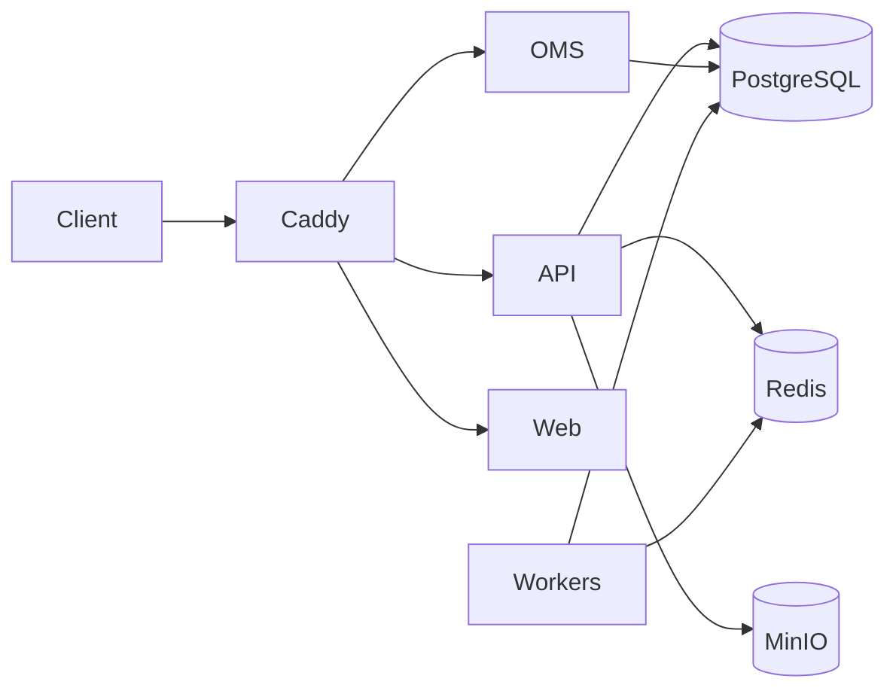

# Onboarding Guide

## Welcome to Astraeus

Astraeus is an AI-powered quantitative trading platform. This guide will get you productive in your first week.

## System Overview (5-minute version)

**What it does:** Ingests market data, runs NLP on alternative data, optimizes portfolios, manages orders, and provides an AI research copilot.

**How it's built:** Python 3.12 monorepo (22 libraries + 5 apps) with a Next.js frontend. Runs on Docker Compose locally and on a single VPS in production.

**Key architectural choices:**
- Event-sourced order management
- Outbox pattern for reliable event publishing
- Point-in-time correctness for all financial data
- Defense-in-depth (rate limiting → auth → risk checks → kill switch)

---

## Development Setup

### Prerequisites

| Tool | Install |
|------|---------|
| Docker Desktop | [docker.com](https://www.docker.com/products/docker-desktop/) |
| uv (Python) | `curl -LsSf https://astral.sh/uv/install.sh \| sh` |
| Make | Pre-installed (macOS/Linux) or `choco install make` (Windows) |
| Git | [git-scm.com](https://git-scm.com/) |
| Node.js ≥ 20 | Only for frontend work |

### First-Time Setup

```bash
git clone https://github.com/SahilSatyam/Astraeus.git
cd Astraeus
./scripts/bootstrap.sh   # Copies .env, installs Python deps, sets up hooks
make dev                  # Builds and starts everything (~3 min first time)
curl http://localhost:8000/healthz  # Verify
```

### What's Running After `make dev`

| Service | URL | Purpose |
|---------|-----|---------|
| API | http://localhost:8000 | Main backend |
| Swagger UI | http://localhost:8000/docs | Interactive API docs |
| Jaeger | http://localhost:16686 | Distributed traces |
| Grafana | http://localhost:3000 | Dashboards (admin/astraeus) |
| Prometheus | http://localhost:9090 | Metrics |
| MinIO Console | http://localhost:9001 | Object storage (astraeus/astraeus123) |
| MLflow | http://localhost:5000 | Experiment tracking |
| JupyterLab | http://localhost:8888 | Notebooks |

---

## Project Structure

```
Astraeus/
├── apps/           # Deployable services
│   ├── api/        # FastAPI main service
│   ├── oms/        # Order Management System
│   ├── workers/    # Background workers
│   ├── recon_worker/ # Reconciliation loop
│   └── web/        # Next.js frontend
├── libs/           # 22 shared Python libraries
├── infra/docker/   # Docker Compose files
├── scripts/        # Utility scripts
├── docs/           # Documentation (you are here)
└── Makefile        # Task runner
```

### Key Files to Read First

1. `README.md` — Full project overview
2. `pyproject.toml` — Workspace configuration, dependencies, tool settings
3. `Makefile` — All available commands
4. `.env.example` — All configuration variables
5. `apps/api/astraeus_api/app.py` — API application factory
6. `libs/config/astraeus_config/base.py` — Settings model

---

## Development Workflow

### Daily Commands

```bash
make dev          # Start/rebuild stack
make stop         # Pause (keep data)
make logs         # Tail all logs
make fmt          # Auto-format code
make lint         # Check for issues
make typecheck    # mypy strict
make test         # Unit tests
```

### Making Backend Changes

1. Edit code in `apps/` or `libs/`
2. For hot-reload: run API locally against Docker services:
   ```bash
   make dev                    # Start infrastructure
   docker compose stop api     # Stop containerized API
   uv run uvicorn astraeus_api.main:app --reload --port 8000
   ```
3. Run checks: `make fmt lint typecheck test`
4. Commit (pre-commit hooks run automatically)

### Making Frontend Changes

```bash
cd apps/web
npm install       # First time
npm run dev       # Hot-reload on http://localhost:3001
```

### Adding a Database Table

1. Edit/create SQLAlchemy model
2. Create migration: `make revision MSG="add my_table"`
3. Apply: `make migrate`
4. Verify: connect to DB and check

### Adding a New API Endpoint

1. Create route file in `apps/api/astraeus_api/routes/`
2. Define router with FastAPI decorators
3. Register in `apps/api/astraeus_api/routes/__init__.py`
4. Include in `apps/api/astraeus_api/app.py`

### Adding a New Library

1. Create directory: `libs/my_lib/`
2. Add `pyproject.toml` with package metadata
3. Add to workspace in root `pyproject.toml` under `[tool.uv.sources]`
4. Run `uv sync`

---

## Testing

### Test Markers

```bash
make test         # Unit tests only (fast, no containers)
make test-int     # Integration tests (needs running stack)
```

### Writing Tests

- Place tests in `tests/` subdirectory of each app/lib
- Use `@pytest.mark.unit` or `@pytest.mark.integration`
- Use `hypothesis` for property-based testing of domain logic
- Use `pytest-asyncio` for async tests (auto mode enabled)

---

## Coding Standards

### Python

- **Formatter:** ruff format (line length 100)
- **Linter:** ruff check (extensive rule set, see pyproject.toml)
- **Type checker:** mypy strict mode
- **Target:** Python 3.12
- **Style:** Use `from __future__ import annotations` in all files

### TypeScript

- **Linter:** ESLint with Next.js config
- **Formatter:** Prettier (via ESLint)
- **Testing:** Vitest + Testing Library

### Commit Messages

Follow conventional commits or descriptive messages. Pre-commit hooks enforce:
- No trailing whitespace
- Files end with newline
- No merge conflicts
- No private keys
- No large files (>500KB)
- Valid YAML/TOML/JSON
- LF line endings

---

## Architecture Quick Reference



**Data flows left-to-right:**
- Market data sources → Workers → PostgreSQL → Feature Store → Portfolio Optimizer → OMS → Broker
- Documents → NLP Pipeline → Embeddings → RAG → AI Copilot

---

## Getting Help

- **API docs:** http://localhost:8000/docs (interactive Swagger)
- **Traces:** http://localhost:16686 (Jaeger — see how requests flow)
- **Dashboards:** http://localhost:3000 (Grafana — system metrics)
- **This documentation:** `docs/` directory
- **Code search:** Use your IDE or `grep -r "pattern" apps/ libs/`
