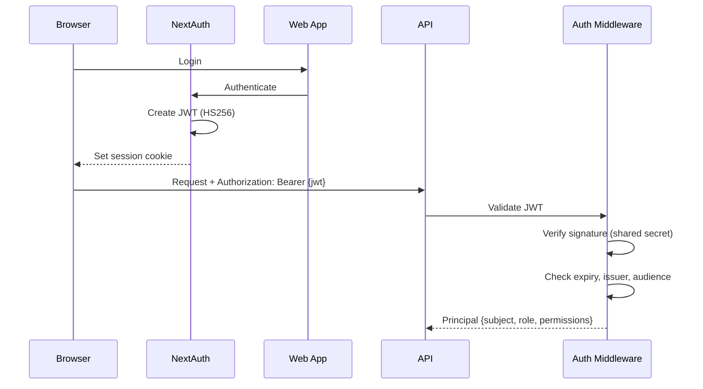
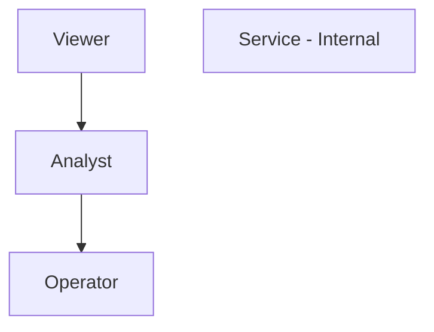
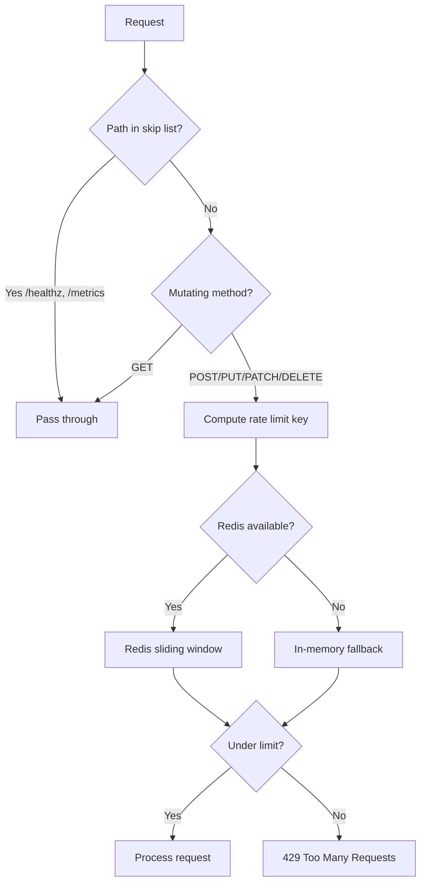
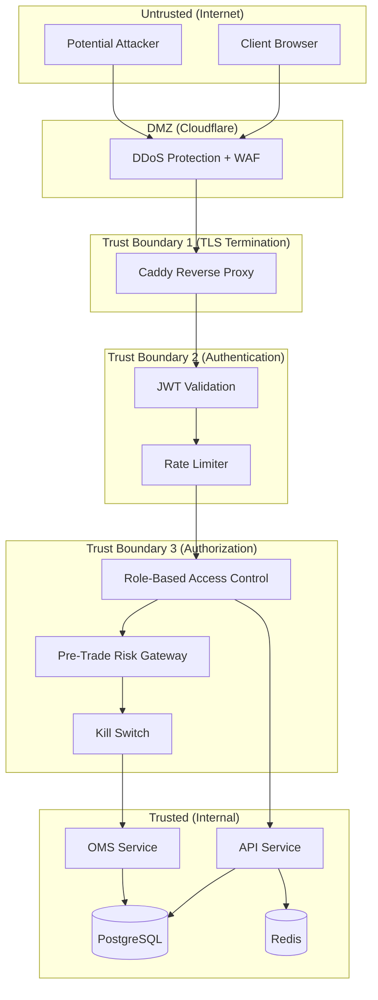

# Security Architecture

## Overview

Astraeus implements defense-in-depth security across authentication, authorization, secrets management, rate limiting, and supply chain hardening.

## Authentication

### JWT-Based Authentication



### Configuration

| Setting | Default | Description |
|---------|---------|-------------|
| `ASTRAEUS_AUTH_JWT_SECRET` | `change-me-in-production` | Shared signing secret |
| `ASTRAEUS_AUTH_JWT_ALGORITHM` | `HS256` | HMAC-SHA256 |
| `ASTRAEUS_AUTH_JWT_ISSUER` | `astraeus` | Token issuer claim |
| `ASTRAEUS_AUTH_JWT_AUDIENCE` | `astraeus-api` | Token audience claim |
| `ASTRAEUS_AUTH_ACCESS_TOKEN_EXPIRE_SECONDS` | `3600` | 1 hour TTL |
| `ASTRAEUS_AUTH_SERVICE_TOKEN_EXPIRE_SECONDS` | `86400` | 24 hour TTL (service-to-service) |
| `ASTRAEUS_AUTH_ENABLED` | `true` | Can disable for local dev |

### Public Paths (no auth required)

- `/healthz`, `/readyz`, `/metrics`
- `/health/live`, `/health/ready`
- `/docs`, `/openapi.json`

### Fail-Safe: Default Secret Rejection

The `AuthSettings` model validator refuses to start in staging/prod with the default development JWT secret:

```python
@model_validator(mode="after")
def _reject_default_secret_outside_local(self) -> AuthSettings:
    env = os.environ.get("ASTRAEUS_ENV", "local")
    if env in {"staging", "prod"} and self.jwt_secret == "change-me-in-production":
        raise ValueError("Refusing to start with default JWT secret")
```

---

## Authorization (RBAC)

### Role Hierarchy



### Permission Matrix

| Permission | Viewer | Analyst | Operator | Service |
|------------|:------:|:-------:|:--------:|:-------:|
| `read:positions` | ✓ | ✓ | ✓ | ✓ |
| `read:orders` | ✓ | ✓ | ✓ | ✓ |
| `read:market_data` | ✓ | ✓ | ✓ | ✓ |
| `read:features` | ✓ | ✓ | ✓ | ✓ |
| `read:pnl` | | ✓ | ✓ | ✓ |
| `write:recommendations` | | ✓ | ✓ | ✓ |
| `write:agents` | | ✓ | ✓ | ✓ |
| `approve:recommendations` | | ✓ | ✓ | ✓ |
| `write:orders` | | | ✓ | ✓ |
| `write:kill_switch` | | | ✓ | ✓ |
| `write:strategies` | | | ✓ | ✓ |
| `admin:all` | | | ✓ | ✓ |

### Enforcement

```python
# Route-level enforcement via FastAPI dependencies
@router.post("/oms/orders")
async def submit_order(
    user: Annotated[Principal, Depends(require_trading_permission)],
):
    ...
```

---

## Rate Limiting

### Architecture



### Per-Route Limits

| Route Prefix | Limit (rpm) | Rationale |
|--------------|:-----------:|-----------|
| Global default | 300 | General API protection |
| `/oms/orders` | 60 | Prevent order floods |
| `/killswitch` | 10 | Sensitive operation |
| `/agents/runs` | 20 | Expensive AI workflows |
| `/reco/replay` | 5 | Heavy pipeline replay |

### Implementation Details

- **Algorithm:** Sliding window using Redis sorted sets (ZADD/ZREMRANGEBYSCORE/ZCARD)
- **Key format:** `ratelimit:{client_ip}:{path_segment}`
- **Fail-open:** Redis errors don't block requests (logged as warning)
- **Headers:** `X-RateLimit-Limit`, `X-RateLimit-Remaining`, `Retry-After`

---

## Secrets Management

### Development

- `.env` file (gitignored) with development defaults
- `.env.example` committed as template
- `scripts/env-lint.py` ensures `.env.example` covers all Settings fields

### Production

- `.env.prod` on VPS (not in repository)
- GitHub Secrets for CI/CD (VPS_HOST, VPS_USER, VPS_SSH_KEY)
- No secrets in Docker images or Helm values

### Validation

The `Settings` model validator rejects default development secrets in staging/prod:
- `ASTRAEUS_DB_PASSWORD` ≠ "astraeus"
- `ASTRAEUS_MINIO_SECRET_KEY` ≠ "astraeus123"
- `ASTRAEUS_AUTH_JWT_SECRET` ≠ "change-me-in-production"

---

## Supply Chain Security

### GitHub Actions Hardening

All third-party actions are pinned by commit SHA (not tag):
```yaml
- uses: actions/checkout@11bd71901bbe5b1630ceea73d27597364c9af683 # v4.2.2
```

Dependabot is configured to propose SHA bumps automatically.

### Pre-Commit Hooks

| Hook | Purpose |
|------|---------|
| `gitleaks` | Detect secrets in commits |
| `detect-private-key` | Block private key commits |
| `check-added-large-files` | Prevent accidental large file commits (>500KB) |
| `ruff` | Lint for security issues (S rules) |

### CI Security Checks

- **gitleaks-action** — Full repository secret scan
- **Trivy config scan** — HIGH/CRITICAL severity, exit-code 1
- **Import audit** — Ensures LLM ↔ Broker code isolation
- **Policy checks** — No `latest` tags, no hardcoded secrets in manifests

---

## API Security

### Input Validation

- All request bodies validated via Pydantic models
- Path parameters validated (e.g., UUID format check)
- Query parameters typed and bounded

### Response Security

- `X-Request-Id` header on every response (correlation)
- No stack traces in production error responses
- RFC 7807 Problem Details format for errors

### Proxy Security

- `ProxyHeadersMiddleware` trusts `X-Forwarded-For` from configured CIDR
- Real client IP used for rate limiting and audit logging
- CORS not configured (same-origin via Caddy in prod)

---

## Trust Boundary Diagram



---

## Data Protection

### At Rest
- PostgreSQL data on Docker volumes (host filesystem encryption recommended)
- MinIO objects on Docker volumes
- Redis AOF persistence

### In Transit
- TLS 1.3 (Caddy auto-HTTPS) for external traffic
- Unencrypted within Docker bridge network (acceptable for single-host)

### Sensitive Data Handling
- Passwords stored as `SecretStr` (Pydantic) — never serialized to logs
- `Redactor` processor scrubs sensitive keys from structured logs
- Trade journal is append-only (UPDATE/DELETE revoked at DB level)
