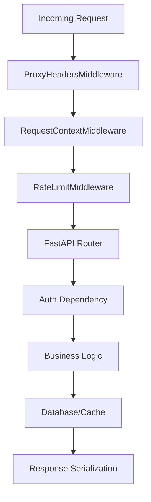
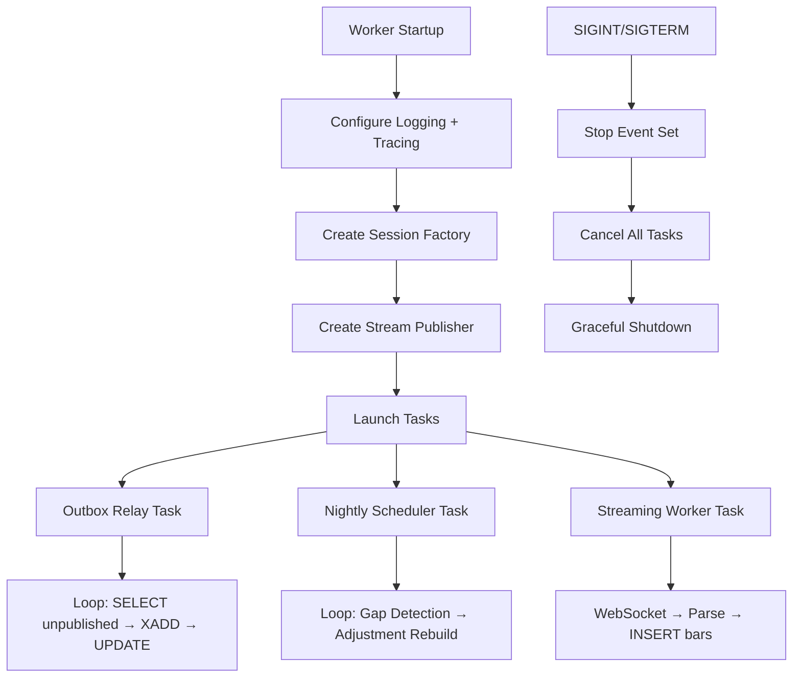
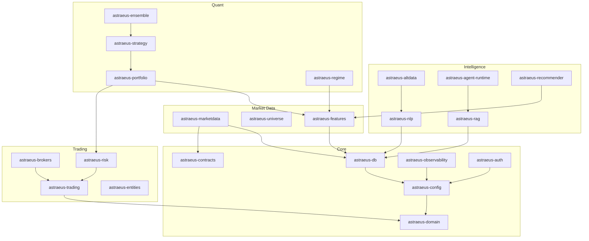

# System Components

## Application Services

### 1. API Service (`apps/api`)

**Purpose:** Primary HTTP interface for the platform. Serves CRUD operations, AI copilot, recommendations, market data queries, and health probes.

**Responsibilities:**
- Request routing and validation
- Authentication and authorization enforcement
- Rate limiting (per-route, Redis-backed)
- Observability instrumentation (traces, metrics, structured logs)
- OpenAPI schema generation

**Dependencies:**
- PostgreSQL (via `astraeus-db`)
- Redis (rate limiting, caching)
- MinIO (document storage for RAG)
- All `libs/*` packages

**Public Interfaces:**
- `GET /healthz` — Liveness probe
- `GET /readyz` — Readiness probe (checks DB connectivity)
- `GET /version` — Service metadata
- `GET /metrics` — Prometheus scrape endpoint
- `POST /agents/runs` — Start AI workflow
- `GET /agents/runs/{id}` — Get workflow status
- `GET /agents/runs/{id}/trace` — Get workflow trace
- Market data, features, alt-data, RAG, recommender, HITL routes

**Internal Workflow:**

**Error Handling:** Centralized exception handlers convert `AstraeusError` to RFC 7807 Problem Details JSON. Unhandled exceptions return 500 with a correlation request_id.

**Scalability:** Stateless — can run multiple replicas behind Caddy. Rate limiting state shared via Redis.

**Failure Modes:**
- DB unavailable → `/readyz` returns 503, liveness still OK
- Redis unavailable → Rate limiter falls back to in-memory (per-process)
- MinIO unavailable → RAG/document endpoints degrade gracefully

---

### 2. OMS Service (`apps/oms`)

**Purpose:** Order Management System — handles order submission, cancellation, state tracking, and kill switch management.

**Responsibilities:**
- Idempotent order submission (dedup on `client_order_id`)
- Event-sourced order state machine
- Pre-trade risk gateway (exposure caps, position limits, daily loss, AI confidence)
- Kill switch management (arm/disarm per scope)
- Position tracking
- Reconciliation diff detection

**Dependencies:**
- PostgreSQL (order_t, order_event, fill, position tables)
- Redis (kill switch state cache, rate limiting)
- Broker adapters (`astraeus-brokers`)

**Public Interfaces:**
- `POST /oms/orders` — Submit order (idempotent, requires trading permission)
- `POST /oms/orders/{id}/cancel` — Cancel order
- `GET /oms/orders/{id}` — Get order details
- `GET /oms/orders` — List orders (filterable)
- `POST /killswitch/arm` — Arm kill switch
- `POST /killswitch/disarm` — Disarm kill switch
- `GET /killswitch/status` — Get kill switch state
- `GET /positions` — Current positions
- `GET /recon/diffs` — Reconciliation differences

**Error Handling:**
- `OrderAlreadyExists` → Returns existing order (idempotent 200)
- `KillSwitchActive` → 423 Locked
- `InvalidTransitionError` → 400 Bad Request
- Risk check failures → 422 with detailed rejection reasons

**Scalability:** Single instance recommended (event ordering guarantees). Can scale reads with replicas.

**Failure Modes:**
- Broker API timeout → Order stays in `pending_new`, retry on next reconciliation
- Kill switch Redis unavailable → Fail-closed (reject orders)

---

### 3. Workers Service (`apps/workers`)

**Purpose:** Background task execution — streaming ingestion, outbox relay, nightly batch jobs.

**Responsibilities:**
- Outbox relay: Drains outbox table into Redis Streams (every 2 seconds)
- Gap detection: Compares exchange calendar vs actual data (nightly)
- Corporate action adjustment: Rebuilds adjusted price bars (nightly)
- Streaming ingestion: WebSocket connection for live market bars (continuous)

**Dependencies:**
- PostgreSQL (market data tables, outbox)
- Redis Streams (event publishing)
- Alpaca WebSocket API (streaming)

**Internal Workflow:**

**Error Handling:** Each task runs independently with its own error handling. Streaming worker auto-restarts with 10-second backoff on failure.

**Scalability:** Single instance (outbox relay requires single-writer semantics). Streaming can be sharded by symbol.

**Failure Modes:**
- Redis unavailable → Outbox relay logs events (no publish), retries on reconnect
- Alpaca WS disconnect → Auto-reconnect with exponential backoff
- Nightly job failure → Logged, retried next cycle

---

### 4. Recon Worker (`apps/recon_worker`)

**Purpose:** Continuous reconciliation between local position state and broker-reported positions.

**Responsibilities:**
- Poll broker positions every 5 seconds
- Compare against local `position` table
- Detect and record drifts in `reconciliation_diff`
- Alert on unresolved differences

**Dependencies:**
- PostgreSQL (position, reconciliation_diff tables)
- Broker adapters (Alpaca)

**Failure Modes:**
- Broker API unavailable → Skip cycle, log warning, retry next interval
- DB unavailable → Crash and restart (systemd/Docker restart policy)

---

### 5. Web Frontend (`apps/web`)

**Purpose:** Next.js 16 single-page application providing the trader/analyst UI.

**Responsibilities:**
- Portfolio dashboard and visualization
- Order entry and management
- Market data charts (ECharts, Lightweight Charts)
- AI copilot chat interface
- Recommendation review and approval

**Dependencies:**
- API Service (REST + WebSocket)
- NextAuth 4 (authentication)

**Technology:**
- Next.js 16 (App Router, SSR)
- React 19
- Tailwind CSS 4
- TanStack Query (data fetching)
- TanStack Table (data grids)
- Zustand (client state)
- Zod (validation)
- ECharts + Lightweight Charts (visualization)

---

## Shared Libraries

### Library Catalog

| Library | Purpose | Key Exports |
|---------|---------|-------------|
| `astraeus-domain` | Pure domain types, no IO | `Symbol`, `OrderId`, `AccountId`, `AstraeusError` |
| `astraeus-contracts` | Shared DTOs and event schemas | `BarEvent`, `HealthResponse`, `PortfolioWeight`, `SignalEvent` |
| `astraeus-config` | Centralized pydantic-settings | `Settings`, `DatabaseSettings`, `RedisSettings`, `Environment` |
| `astraeus-db` | SQLAlchemy models + Alembic migrations | `Base`, `get_engine`, `get_sessionmaker`, `dispose_engines` |
| `astraeus-observability` | Logging, tracing, metrics | `configure_logging`, `configure_tracing`, `Redactor` |
| `astraeus-auth` | JWT validation + RBAC | `Principal`, `Role`, `get_current_user`, `require_role` |
| `astraeus-marketdata` | Market data ingestion + streaming | Adapters, gap detection, adjustments, outbox relay |
| `astraeus-universe` | Asset universe management | Bitemporal membership tracking |
| `astraeus-features` | Feature store DSL | Registration, materialization, PIT retrieval |
| `astraeus-nlp` | NLP pipeline | Sentiment (FinBERT), NER (spaCy), embeddings, topics (BERTopic) |
| `astraeus-altdata` | Alternative data ingestion | Reddit, RSS, SEC EDGAR connectors |
| `astraeus-rag` | RAG retrieval | Hybrid BM25 + vector search with reciprocal rank fusion |
| `astraeus-agent-runtime` | AI agent framework | Workflow orchestrator, step execution, cost tracking |
| `astraeus-recommender` | ML recommendations | Trade recommendation pipeline with explainability |
| `astraeus-portfolio` | Portfolio optimization | Convex optimization (cvxpy), constraint handling |
| `astraeus-strategy` | Trading strategies | Strategy registry, cost models, signal generation |
| `astraeus-regime` | Market regime detection | Hidden Markov Models (hmmlearn) |
| `astraeus-ensemble` | Strategy ensemble | Multi-strategy combination logic |
| `astraeus-trading` | Order state machine | `OrderStateMachine`, `OrderEvent`, `KillSwitchManager` |
| `astraeus-brokers` | Broker adapters | `AlpacaAdapter`, `BinancePaperAdapter`, `ExecutionManagementSystem` |
| `astraeus-risk` | Pre-trade risk | `PreTradeRiskGateway`, `CircuitBreaker`, risk rules |
| `astraeus-entities` | Business entities | Shared entity definitions |
