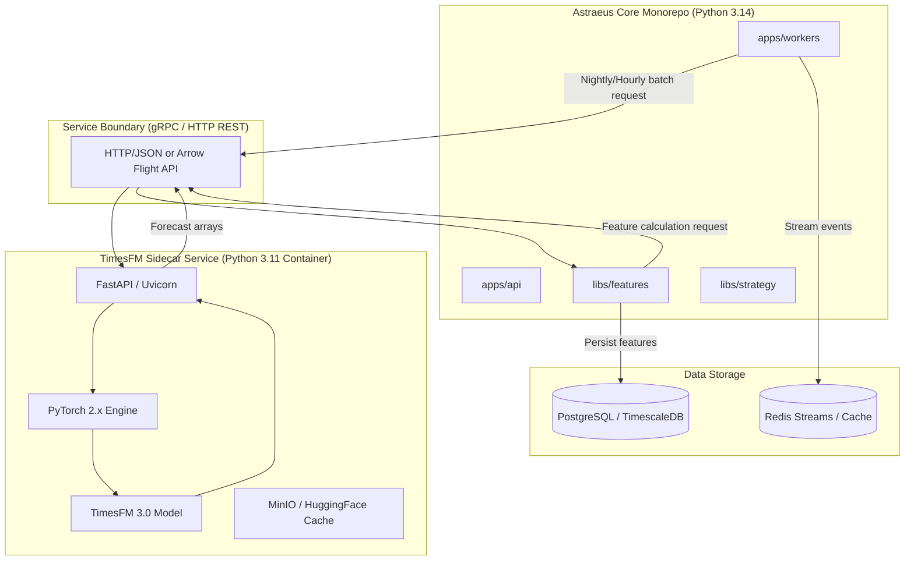

# Astraeus — Google TimesFM 3.0 Feasibility Assessment

> **Executive Context:** Evaluation of integrating Google's **TimesFM 3.0** (Time Series Foundation Model) into the Astraeus quantitative research and trading platform.
> **Key Finding:** **Conditionally Feasible via Sidecar Container / Microservice Architecture**. Direct in-process monorepo integration is currently blocked by Python 3.14 CPython binary incompatibility with PyTorch/JAX ecosystems.

---

## 1. Executive Summary

Google's **TimesFM** (Time Series Foundation Model) is a pretrained decoder-only transformer model designed for zero-shot time series forecasting. The 3.0/2.0 series (ranging from 200M to 500M parameters, trained on 100B+ time-series data points) offers zero-shot point and quantile forecasting capabilities across variable context lengths and frequencies.

This feasibility study evaluates integrating TimesFM 3.0 into Astraeus across four core dimensions:
1. **Language & Ecosystem Compatibility:** Python runtime restrictions and deep learning package dependencies.
2. **Infrastructure & Hardware Footprint:** Memory, compute, latency, and single-VPS deployment limits.
3. **Quantitative Domain Fit:** Efficacy on financial asset price forecasting vs. volatility, volume, alternative data, and macro indicators.
4. **Architectural Design:** Integration paths, microservice boundaries, and data flow.

---

## 2. Technical & Ecosystem Compatibility

### 2.1 Python Runtime Incompatibility (The Primary Blocker)

Astraeus strictly enforces Python **3.14.7** across the entire monorepo (`pyproject.toml` specifies `requires-python = ">=3.14,<3.15"` and `.python-version` is `3.14.7`).

| Stack Component | Astraeus Spec | TimesFM 3.0 Dependency | Conflict Status |
|-----------------|---------------|------------------------|-----------------|
| **Python Runtime** | `3.14.7` | `3.10` – `3.12` | ❌ PyTorch / JAX wheel binaries not available for CPython 3.14 |
| **Deep Learning Engine** | Pure Python / ONNX / Light PyTorch | PyTorch 2.x or JAX / Flax | ❌ Native build fails on Python 3.14 pre-release C-API |
| **Transformers Ecosystem** | `transformers >= 4.40` | `huggingface_hub`, `einops`, `utilsforecast` | ⚠️ Transitive C-extension dependencies lack Python 3.14 wheels |

**Conclusion:** Direct inclusion of `timesfm` as a Python dependency in `libs/strategy`, `libs/features`, or `libs/regime` is **not feasible** in the current Python 3.14 workspace environment without breaking workspace installation or compiling complex C++ extension wheels from source.

---

## 3. Quantitative Domain Fit & Strategic Alignment

### 3.1 The Financial Data Fallacy: Price vs. Volatility

Zero-shot time series foundation models (TimesFM, Chronos, Moirai) are trained primarily on physical, industrial, macro, and demand time series (electricity, weather, retail sales, traffic). These series display strong trend and seasonal patterns.

Directly applying TimesFM to financial price series ($P_t$) or log prices ($\ln P_t$) to forecast price directions leads to poor performance:
- Financial price series have low Signal-to-Noise Ratios (SNR) and are near-martingale random walks under market efficiency.
- A zero-shot model predicting raw prices tends to output trivial persistence forecasts ($\hat{y}_{t+h} \approx y_t$).

### 3.2 High-Value Quantitative Workloads in Astraeus

Rather than predicting stock prices directly, TimesFM can deliver high value when targeted at **predictable financial dynamics**:

```
                               ┌──────────────────────────────────────────────────────────┐
                               │                     TimesFM 3.0                          │
                               └────────────────────────────┬─────────────────────────────┘
                                                            │
         ┌───────────────────────────┬──────────────────────┼───────────────────────────┐
         ▼                           ▼                      ▼                           ▼
┌─────────────────┐         ┌─────────────────┐    ┌─────────────────┐         ┌─────────────────┐
│ Realized        │         │ Alt-Data &      │    │ Intraday Volume │         │ Macro &         │
│ Volatility      │         │ Sentiment Flow  │    │ Profiles        │         │ Regime Shifts   │
├─────────────────┤         ├─────────────────┤    ├─────────────────┤         ├─────────────────┤
│ • Parkinson Vol │         │ • Reddit counts │    │ • POV profiles  │         │ • Yield curve   │
│ • Garman-Klass  │         │ • News sentiment│    │ • OMS cost      │         │ • Macro indices │
│ • 5d/21d forecast│        │ • SEC filings   │    │   calibration   │         │ • HMM inputs    │
└─────────────────┘         └─────────────────┘    └─────────────────┘         └─────────────────┘
```

1. **Realized Volatility Forecasting (`libs/features`, `libs/risk`):**
   - Volatility displays strong autocorrelation, volatility clustering, and long memory.
   - TimesFM zero-shot forecasts can serve as an overlay or replacement for GARCH(1,1) / HAR-RV models for position sizing and VaR risk limits.
2. **Alternative Data & News Sentiment Flow (`libs/altdata`, `libs/nlp`):**
   - Forecasting sentiment volume trends (e.g. EDGAR filings per week, Reddit comment spikes) to dynamically adjust signal decay weights in `libs/ensemble`.
3. **Execution Cost & Intraday Volume Profiles (`libs/marketdata`, `apps/oms`):**
   - Forecasting volume-at-time curves for participant-weighted fill models and market impact calculations in backtesting and live order routing.
4. **Macro & Regime Indicators (`libs/regime`):**
   - Forecasting macro factors (FRED series) to provide forward-looking transition probabilities to the Hidden Markov Model (HMM) regime detector.

---

## 4. Infrastructure & Hardware Footprint

Astraeus is architected to run efficiently on a single VPS (e.g. Hetzner 16GB / 32GB RAM).

| Resource Metric | TimesFM 200M (Small) | TimesFM 500M (Medium) | VPS Capacity (16GB RAM) | Assessment |
|-----------------|----------------------|-----------------------|-------------------------|------------|
| **Weights File Size** | ~400 MB (FP16) | ~1.0 GB (FP16) | 100 GB SSD | ✅ Negligible storage impact |
| **Loaded RAM (FP16/INT8)** | ~1.2 GB | ~2.5 GB | 16 GB (12 GB available) | ✅ Well within memory budget |
| **CPU Inference Latency (Batch=64)** | ~120 ms | ~320 ms | 4 vCPUs | ⚠️ Suitable for daily/hourly, not sub-second |
| **GPU Inference Latency (CUDA)** | ~15 ms | ~35 ms | Optional GPU | ✅ Real-time execution viable |

**Throughput Profile:** On a 4 vCPU / 16GB RAM VPS, batch inference on 500 stocks for a 5-day forecast horizon takes ~2.5 seconds. This makes TimesFM ideal for **hourly feature generation, nightly batch processing, and daily rebalancing strategies**.

---

## 5. Recommended Architecture & Integration Strategy

To integrate TimesFM 3.0 without compromising Astraeus's Python 3.14 monorepo requirements, we recommend a **Sidecar Microservice Architecture**.

### 5.1 Architecture Diagram



### 5.2 Deployment Options

#### Option A: Dedicated Python 3.11 Sidecar Container (Recommended)
- **Implementation:** Create `apps/timesfm_service` with its own `Dockerfile` using Python 3.11.
- **Protocol:** FastAPI REST endpoint or gRPC with Apache Arrow / Polars buffer serialization.
- **Pros:** Complete isolation; zero impact on core Python 3.14 monorepo dependencies.
- **Cons:** Additional Docker container running in Docker Compose (~1.5GB RAM footprint).

#### Option B: ONNX Runtime Export
- **Implementation:** Convert TimesFM transformer weights to ONNX (`.onnx`) format and run via `onnxruntime` inside the Python 3.14 monorepo.
- **Pros:** Runs directly inside Python 3.14 (since `onnxruntime` C-bindings install cleanly); lower CPU overhead.
- **Cons:** Complex initial model export and quantization work; maintenance required for model architecture updates.

---

## 6. Implementation Roadmap

```
Phase 1: Proof of Concept Sidecar Service
  ├── Create Dockerfile for Python 3.11 sidecar container (`apps/timesfm_service`)
  ├── Implement `/health` and `/forecast` REST endpoints with batch input
  └── Integrate model loading from MinIO or HuggingFace hub

Phase 2: Feature Store Integration (`libs/features`)
  ├── Implement `TimesFMVolatilityFeature` client in `libs/features`
  ├── Implement `TimesFMVolumeProfileFeature` for execution cost modeling
  └── Benchmark forecast latency and accuracy vs. GARCH(1,1) baselines

Phase 3: Strategy & Backtesting Evaluation (`libs/strategy`)
  ├── Integrate TimesFM volatility forecasts into position sizing in `MLForecast`
  ├── Measure Sharpe ratio, Max Drawdown, and Probabilistic Sharpe Ratio (PSR)
  └── Document operational learnings in `.jules/bolt.md`
```

---

## 7. Summary Feasibility Scorecard

| Dimension | Rating | Note |
|-----------|--------|------|
| **Python 3.14 Monorepo Fit** | 🔴 Incompatible | Requires container boundary (Python 3.11/3.12 sidecar). |
| **Resource & Infrastructure Fit** | 🟢 Excellent | Fits within 1.5–2.5GB RAM budget on standard single VPS. |
| **Financial Utility (Volatility/Volume)** | 🟢 High | Strong fit for volatility clustering and volume profile modeling. |
| **Financial Utility (Price Level)** | 🔴 Low | Poor fit for direct price direction forecasting. |
| **Overall Feasibility** | 🟡 Conditionally Feasible | Recommended via Python 3.11 Sidecar container for volatility/volume features. |
