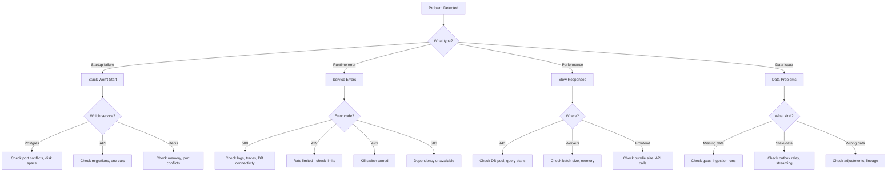

# Troubleshooting Guide

## Decision Tree



---

## Common Issues

### Stack Won't Start

**Symptom:** `make dev` fails or containers keep restarting

**Diagnosis:**
```bash
# Check container status
make ps

# Check logs for failing container
docker compose logs postgres --tail=20
docker compose logs api --tail=20
```

**Common Causes:**

| Cause | Solution |
|-------|----------|
| Port 5432 already in use | Stop local PostgreSQL: `sudo systemctl stop postgresql` |
| Port 6379 already in use | Stop local Redis: `sudo systemctl stop redis` |
| Port 3000 already in use | Grafana conflict — stop other service on 3000 |
| Docker not running | Start Docker Desktop |
| Out of disk space | `docker system prune -f` |
| Out of memory | Increase Docker memory limit to 8GB+ |

### Database Connection Errors

**Symptom:** API returns 503, logs show "connection refused"

**Diagnosis:**
```bash
# Is Postgres healthy?
docker ps | grep postgres
# Should show "(healthy)"

# Can we connect?
docker exec -it astraeus-postgres-1 psql -U astraeus -d astraeus -c "SELECT 1"
```

**Solutions:**
1. Wait for Postgres to finish starting (check health status)
2. Run migrations manually: `make migrate`
3. Check `.env` has correct `ASTRAEUS_DB_*` values
4. Nuclear: `make clean && make dev`

### Migration Failures

**Symptom:** API container exits on startup with migration error

**Diagnosis:**
```bash
docker compose logs api | grep -i "alembic\|migration\|error"
```

**Solutions:**
1. Check current revision: `cd libs/db && uv run alembic current`
2. Check for conflicts: `cd libs/db && uv run alembic heads`
3. If stuck, stamp current: `cd libs/db && uv run alembic stamp head`
4. If corrupted, reset: `make clean && make dev`

### Rate Limiting Issues

**Symptom:** Requests returning 429 unexpectedly

**Diagnosis:**
```bash
# Check rate limit headers in response
curl -v http://localhost:8000/api/some-endpoint

# Check Redis rate limit keys
docker exec astraeus-redis-1 redis-cli KEYS "ratelimit:*"
```

**Solutions:**
1. Increase limits via env vars (e.g., `ASTRAEUS_RATE_LIMIT_GLOBAL=600`)
2. Clear rate limit state: `docker exec astraeus-redis-1 redis-cli FLUSHDB`
3. Check if client IP detection is correct (proxy headers)

### Outbox Relay Not Publishing

**Symptom:** Events stuck in outbox table (published_at IS NULL)

**Diagnosis:**
```bash
# Check outbox backlog
docker exec astraeus-postgres-1 psql -U astraeus -d astraeus \
  -c "SELECT count(*) FROM outbox WHERE published_at IS NULL"

# Check worker logs
docker compose logs workers | grep "outbox"
```

**Solutions:**
1. Check Redis connectivity from workers container
2. Restart workers: `docker compose restart workers`
3. If Redis is down, events accumulate safely in outbox (at-least-once)

### Streaming Worker Disconnects

**Symptom:** No live market data, logs show "streaming_task_failed"

**Diagnosis:**
```bash
docker compose logs workers | grep "streaming"
```

**Solutions:**
1. Check Alpaca API credentials in `.env`
2. Check Alpaca service status (external)
3. Worker auto-restarts with 10s backoff — check if it's reconnecting
4. If credentials expired, update and restart workers

### MinIO Bucket Missing

**Symptom:** Document upload fails, "bucket not found"

**Solution:**
```bash
# Re-run bucket initialization
docker compose --profile init run --rm minio-init
```

### Pre-commit Hooks Failing

**Symptom:** `git commit` rejected by hooks

**Solutions:**
```bash
# Fix formatting
make fmt

# Check what's failing
uv run pre-commit run --all-files

# Skip hooks temporarily (not recommended)
git commit --no-verify -m "message"

# Reinstall hooks
make precommit-install
```

### Type Check Errors (mypy)

**Symptom:** `make typecheck` fails

**Solutions:**
1. Check the specific error and file
2. Ensure all packages are synced: `uv sync --all-packages`
3. Some libs have relaxed mypy settings (see `pyproject.toml` overrides)
4. Add type stubs if missing: `uv add --dev types-package-name`

### Frontend Build Failures

**Symptom:** `npm run build` fails in `apps/web`

**Solutions:**
```bash
cd apps/web
rm -rf node_modules .next
npm install
npm run build
```

### Out of Memory (Docker)

**Symptom:** Containers killed (OOMKilled), system sluggish

**Solutions:**
1. Increase Docker Desktop memory (Settings → Resources → 8GB+)
2. Stop non-essential services:
   ```bash
   docker compose stop grafana prometheus jaeger mlflow jupyterlab
   ```
3. Check which container uses most memory: `docker stats`

### WSL 2 Performance Issues (Windows)

**Symptom:** Everything is slow on Windows

**Solutions:**
1. Ensure repo is cloned inside WSL filesystem (`~/Astraeus`), NOT on `/mnt/c/`
2. Add to `%USERPROFILE%\.wslconfig`:
   ```ini
   [wsl2]
   memory=8GB
   ```
3. Restart WSL: `wsl --shutdown`

---

## Diagnostic Commands

```bash
# Container status
make ps

# Service logs (all)
make logs

# Database connectivity
docker exec astraeus-postgres-1 pg_isready -U astraeus

# Redis connectivity
docker exec astraeus-redis-1 redis-cli ping

# API health
curl http://localhost:8000/healthz
curl http://localhost:8000/readyz

# Check disk usage
docker system df

# Check resource usage
docker stats --no-stream

# Database table sizes
docker exec astraeus-postgres-1 psql -U astraeus -d astraeus \
  -c "SELECT relname, pg_size_pretty(pg_total_relation_size(relid)) FROM pg_catalog.pg_statio_user_tables ORDER BY pg_total_relation_size(relid) DESC LIMIT 10;"
```
